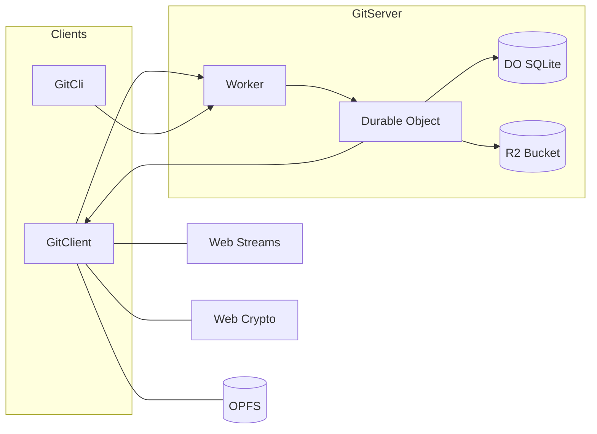

> [!WARNING]  
> Experimental: API is unstable and not production-ready.

# @chr33s/git

Implements the native Git Server, Client, Cli smart-HTTP protocol for fetch and push with modern TypeScript, Web Streams, and modern Web APIs.

## Prerequisites

- Node.js 24+ and npm 11+

## Architecture

Native `GitServer` smart-HTTP protocol deployed at the edge, in‑browser `GitClient` and `GitCli`. Cloudflare Worker entrypoint that routes requests to a per‑repo Durable Object. Refs/trees/commits are kept in DO SQLite; large blobs live in R2. In the browser using standard Web APIs.



## GitServer: Git over HTTP

### Stack

- Cloudflare Workers runtime
- Durable Objects with built‑in SQLite for refs, commits, trees, and tags
- Cloudflare R2 for Git object blobs (file contents)

### HTTP API

- Service discovery: `GET /:repo/info/refs?service=git-{upload,receive}-pack`
- Upload‑pack (fetch): `POST /:repo/git-upload-pack`
- Receive‑pack (push): `POST /:repo/git-receive-pack`

See `src/index.ts` for routing and bindings.

## GitClient: Git in the browser (and Node 22+)

`GitClient` provides Git protocol functionality using only Web standards:

- `fetch()` for HTTP
- Web Streams for efficient data processing
- Web Crypto API for SHA‑1 hashing
- TextEncoder/TextDecoder for string/binary conversion
- OPFS (Origin Private File System) for file checkout

### Features

- Repository operations: info/refs, clone/fetch, create Git objects (blob, tree, commit)
- Full pack‑file handling for upload‑pack and receive‑pack
- Browser‑first: uses Web APIs end‑to‑end
- OPFS integration: automatic checkout to the browser’s private filesystem with repo‑based directory caching

See `JsDoc` comments.

### Browser compatibility

Core functionality (info, clone, create objects):

- Chrome/Edge: 88+ (Web Streams, Web Crypto API)
- Firefox: 102+ (Web Streams, Web Crypto API)
- Safari: 14.1+ (Web Streams, Web Crypto API)

File checkout with OPFS:

- Chrome/Edge: 102+ (OPFS support)
- Firefox: Not yet supported (planned)
- Safari: Not yet supported (planned)

The `checkout()` method throws if OPFS is unavailable. Apps can process checkout data manually using cloned objects.

## Development

```sh
# dev
npm install
npm run check   # run lint/format checks (use: npm run fix)
npm test        # run unit tests
npm run test:e2e # run end-to-end tests
npm run dev

# prod
npm run build
npm run deploy
```

### Testing

Includes unit/integration and end-to-end tests:

#### Unit/Integration Tests

Unit tests use Node.js built-in test runner and cover individual functions and components:

```sh
npm test
```

#### End-to-End Tests

E2E tests use Playwright to test the complete client/server functionality:

```sh
# Install Playwright browsers (first time only)
npx playwright install

# Run E2E tests
npm run test:e2e

# Run E2E tests with UI mode
npm run test:e2e:ui

# Debug E2E tests
npm run test:e2e:debug
```

The E2E tests automatically start the development server and test the Git smart-HTTP protocol endpoints.
