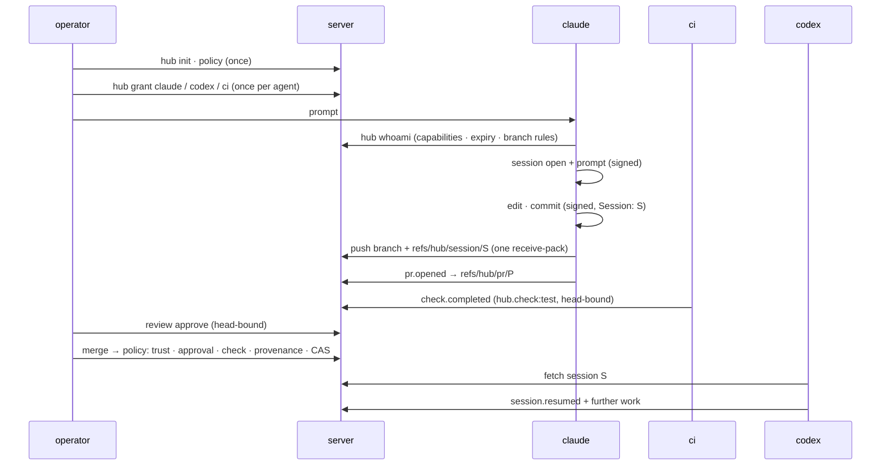

# Git-Native Agents

How an agent becomes a member of a repository, how the sessions that
produce its code become refs beside that code, and what the whole
lifecycle looks like run once — in three parts:

- **[Part I — Agents as members](#part-i--agents-as-members)** — keys,
  grants, credentials, introspection, signing, revocation.
- **[Part II — Session provenance](#part-ii--session-provenance)** —
  sessions as `refs/hub/session/*` event DAGs, plus wake, tasks,
  decisions, memory and budgets (§19–§23).
- **[Part III — The workflow, end to end](#part-iii--the-workflow-end-to-end)**
  — the lifecycle walked once, from `hub init` to a merged, provenanced,
  resumable change.

---

## Part I — Agents as members

A coding agent — Claude Code, Codex, a CI bot — is a member like any other:
its own SSH keypair, its own grant, its own revocation. Nothing here is
agent-specific machinery; this document is the membership model of
[hub.md](hub.md) applied to principals that happen to be software. The one
rule that matters is the first one: **an agent never holds a human's key.**
Sharing a key makes the human's authority the agent's authority, makes
`hub members` lie about who can do what, and makes revoking the agent mean
revoking the human.

- [One key per agent](#one-key-per-agent)
- [Membership: what to grant](#membership-what-to-grant)
- [Credentials: how an agent pushes](#credentials-how-an-agent-pushes)
- [Knowing what you hold: hub whoami](#knowing-what-you-hold-hub-whoami)
- [Signed commits](#signed-commits)
- [Wiring up Claude Code](#wiring-up-claude-code)
- [Wiring up Codex](#wiring-up-codex)
- [Rotation and revocation](#rotation-and-revocation)

### One key per agent

Generate a keypair for the agent identity, not for the machine it runs on:

```sh
ssh-keygen -t ed25519 -f ~/.ssh/agent-claude -N "" -C "claude@agents.example.com"
```

The private key stays wherever the agent runs — a secrets store the agent's
environment injects, or generated fresh inside an ephemeral sandbox. The
repository only ever sees the public half; the fingerprint
(`ssh-keygen -lf ~/.ssh/agent-claude.pub`) is how the member appears in
`hub members` and how it is revoked.

One key per agent _role_ is the useful granularity. A "claude" key and a
"codex" key make `hub members` readable and let each be revoked alone; a key
per sandbox is usually too fine — prefer one durable key per agent injected
into each sandbox, or, for truly disposable environments, a fresh key granted
with a short `--expires-in` so abandoned sandboxes age out of membership on
their own.

### Membership: what to grant

An operator whose key holds `member.invite` (or `repo.admin`) records the
grant in the trust log:

```sh
npx git+ hub grant my-repo --key ~/.ssh/hub \
  --subject ~/.ssh/agent-claude.pub \
  --capability repo.read,source.push,hub.create-pr,hub.comment \
  --expires-in 7776000   # 90 days
```

Capabilities are the authorization primitive, so grant the task rather than a
role:

| agent        | capabilities                                      |
| ------------ | ------------------------------------------------- |
| coding agent | `repo.read,source.push,hub.create-pr,hub.comment` |
| review agent | `repo.read,hub.comment,hub.review`                |
| CI runner    | `repo.read,hub.check:test`                        |
| merge bot    | `repo.read,hub.merge`                             |

Three deliberate omissions. `hub.approve` is the capability merge policy
counts, so granting it to an agent means agent approvals satisfy
`requiredApprovals` — reserve it for humans unless that is exactly what you
want. `hub.check:<name>` is scoped per check name, so a CI agent can vouch
only for the check it runs; `hub.check:*` is for trusted infrastructure.
And `source.force-push`, `member.invite`, `repo.admin` have no business on an
autonomous key at all.

Set `--expires-in` on every agent grant. Agents are exactly the members
nobody remembers to revoke, and an expired grant stops authorizing new
operations while everything it authorized in its window stays valid. Renewal
is a fresh `hub grant` for the same public key.

`hub grant` confirms the grant actually took effect — the trust log is
append-only and its fold skips what it cannot authorize, so the command
rebuilds the projection and fails loudly if the record was refused.
`hub members my-repo` shows the result.

### Credentials: how an agent pushes

An agent authenticates by proving possession of its private key. For stock
`git` — which is what most agents drive — that means minting a short-lived
delegated credential signed by the agent's own key:

```sh
TOKEN=$(npx git+ credential my-repo \
  --key ~/.ssh/agent-claude \
  --capability repo.read,source.push \
  --ttl 3600)

git clone "http://${TOKEN}@127.0.0.1:8080/my-repo"
git push
```

The credential verifies against the trust graph, not a server secret: it can
never carry more capability than the agent's grant, it expires on its TTL,
and revoking the member invalidates every credential it ever minted. Mint one
per task at the start of the agent's session rather than storing a long-lived
one — the private key is the durable secret, the credential is disposable.

A credential minted for a _host_ also carries that host inside its signed
bytes, and is refused anywhere else. That is what the credential helper mints
(it binds to the host `git` names) and what a registered remote is handed on
replication, and it closes the case a `RepoID` alone cannot: an origin and its
replicas share one `RepoID`, so a token good at a mirror is otherwise good
back at the origin, for whatever its holder could push by hand.

### Knowing what you hold: hub whoami

Everything above tells the operator how to authorize an agent. The other
half is the question the agent needs answered before it acts: _what may I
do here, and what will my push be judged by?_ Without a verb for that, the
discovery mechanism is failure — push, get refused, parse the refusal,
retry — which is the most expensive possible protocol for a token-metered
actor.

`hub whoami` answers for one key, as a read-only join of the trust
projection and the branch rules at `refs/meta/policy`:

```sh
$ git+ hub whoami --root . --key ~/.ssh/agent-claude project
{
  "repo": "SHA256:uPHtrtbp5Pi++/nNoJu5g64eYs0PgrULnh5m+T253cI",
  "subject": "SHA256:DaOBdHEQqJ4foVREyhYZaOWu3JrzvKVDLmvZMFEPudw",
  "member": true,
  "why": null,
  "capabilities": ["repo.read", "source.push", "hub.create-pr", "hub.comment"],
  "expiresAt": "2026-11-16T02:47:39.811Z",
  "trust": null,
  "branches": {
    "refs/heads/main": {
      "push": "refused",
      "why": ["requirePullRequest", "requiredApprovals: 1", "requiredChecks: [test]",
              "a direct push meets none of these; open a pull request"]
    },
    "(any other ref)": { "push": "allowed", "why": [] }
  }
}
```

Either half of the key works — a private key carries its own public half,
and what a secret store injects into a sandbox is the private one. Every
field is present on every answer, `null` where it does not apply: the
reader is a program deciding what to do next, and a field that vanishes is
one it has to guess the meaning of. `why` names the single thing standing
between this key and a write — non-membership, revocation, an expired
grant, a trust view too stale for the rules in force.

It invents nothing: no new refs, no new event kinds, no new capability. It
reads the same projection and the same rules document the policy boundary
reads, which is what keeps the answer and the enforcement from drifting
apart. `(any other ref)` is asked as its own case rather than by matching a
wildcard, because the boundary counts two overlapping prefixes as a match —
right for a write that names a whole namespace, wrong here, where it would
report every unprotected branch as protected the moment one branch under it
was.

The same question is answered over the wire, which is the form an agent in
a sandbox actually needs — it holds a clone and a credential, not the bare
repository:

```sh
curl -s "http://<credential>@127.0.0.1:8080/project/whoami"
```

`GET /:repo/whoami` needs no capability of its own: a request may always be
told what it may do, and an anonymous one is told it may do nothing rather
than being refused the question. It answers for the **credential**, not for
the key behind it — a delegated credential narrows what its holder may do,
so the capabilities reported are the intersection. An agent told the
member's full grant would plan a push its own credential cannot make.

Both forms name the _nearest_ obstacle rather than every obstacle. A
credential without `source.push` is told exactly that for a protected
branch, not what that branch would additionally have required — advice
about a push it could never make is noise. Widen the credential and the
branch's own requirements are what is left to answer.

Call it from the session-start hook and drop the output into the agent's
context. An agent that knows before working that `main` takes a pull
request, one approval and a passing `test` check structures the whole
session around that — branches correctly, opens the PR, never attempts the
push that would bounce. It is this document's "your membership grants X"
instruction made live instead of hand-maintained, which is also how it
stops going stale; and because `expiresAt` is queryable, a harness warns or
re-enrolls before a grant's cliff instead of failing mysteriously mid-task.

The principle is the repository's own, read from the other side: authority
is offline-verifiable — so the _subject_ of that authority should be able
to read its own standing the same way. The repository already knows the
answer; this is the verb that asks.

### Signed commits

Membership answers who may _push_; a commit signature answers who _authored_.
They are separate layers and the same key serves both. Configure stock git in
the agent's clone to sign with the agent's key:

```sh
git config user.name  "Claude"
git config user.email "claude@agents.example.com"
git config gpg.format ssh
git config user.signingkey ~/.ssh/agent-claude
git config commit.gpgsign true
```

Verification uses git's ordinary SSH-signing machinery — an
`allowed_signers` file mapping the agent's email to its public key:

```sh
echo "claude@agents.example.com $(cat ~/.ssh/agent-claude.pub)" >> ~/.config/git/allowed_signers
git config gpg.ssh.allowedSignersFile ~/.config/git/allowed_signers
git log --show-signature
```

With one key doing both jobs, "this commit was authored by the agent" and
"this push was authorized for the agent" become the same statement checked
two ways — and a revocation for compromise cuts off both at once.

(`git+ commit` takes its author identity from
`GIT_AUTHOR_NAME`/`GIT_AUTHOR_EMAIL`; commit signing is stock git's job.)

### Wiring up Claude Code

Provision the key and configuration in the environment the agent runs in,
not in the conversation. For a devcontainer or Claude Code on the web, a
setup script (for example a `SessionStart` hook) that runs before the agent
works:

```sh
#!/bin/sh
# expects AGENT_SSH_KEY injected by the environment's secret store
install -m 700 -d ~/.ssh
printf '%s\n' "$AGENT_SSH_KEY" > ~/.ssh/agent-claude
chmod 600 ~/.ssh/agent-claude
ssh-keygen -y -f ~/.ssh/agent-claude > ~/.ssh/agent-claude.pub

git config --global user.name  "Claude"
git config --global user.email "claude@agents.example.com"
git config --global gpg.format ssh
git config --global user.signingkey ~/.ssh/agent-claude
git config --global commit.gpgsign true
```

Then tell the agent what it holds, in `CLAUDE.md`:

```markdown
### Repository access

Your SSH key is ~/.ssh/agent-claude; commits are signed with it
automatically. To push, mint a credential first:
git+ credential <repo> --key ~/.ssh/agent-claude --capability source.push --ttl 3600
and use it as the password in the remote URL. Your membership grants
repo.read, source.push, hub.create-pr and hub.comment — nothing else.
```

### Wiring up Codex

The same shape with Codex's names: the key arrives through the environment's
secrets configuration, the setup script above runs as the environment's setup
command, and the standing instructions live in `AGENTS.md` instead of
`CLAUDE.md`. Grant the Codex key its own membership — the point of per-agent
keys is that `hub members` distinguishes the two, and that one can be revoked
without the other.

### Rotation and revocation

Rotation while everything is healthy is cheap — grant the new key, then
revoke the old one with the reason that says what happened:

```sh
npx git+ hub grant my-repo --key ~/.ssh/hub \
  --subject ~/.ssh/agent-claude-2.pub --capability repo.read,source.push \
  --expires-in 7776000
npx git+ hub revoke my-repo --key ~/.ssh/hub \
  --subject SHA256:oldkeyfingerprint --reason rotated
```

A leaked key is the other reason per-agent keys exist:

```sh
npx git+ hub revoke my-repo --key ~/.ssh/hub \
  --subject SHA256:leakedfingerprint --reason compromised
```

`--reason compromised` is retroactive — events signed by the key are
invalidated even where already accepted, and every credential the key ever
minted dies with it. The blast radius is one agent, which is exactly the
radius the first section bought.

## Part II — Session provenance

**Status:** Implemented
**Scope:** extends [hub.md](hub.md) — trust log (hub §9), event DAGs (hub §16), redaction (hub §21), advertisement hygiene (hub §23), policy boundary (hub §26).
**Session namespace:** `refs/hub/session/*`
**Task namespace:** `refs/hub/task/*` (§20)

---

### 1. Core principle

In a repository whose commits are increasingly agent-authored, the answer to
"why does this code exist" is the instruction that produced it. Today that
answer lives in a hosting provider's session database, reachable only through
a URL in a commit trailer — exactly the dependency hub §1 exists to remove.

A repository SHOULD therefore be able to carry:

```text
source
+ source history
+ the sessions that produced it:
    who was instructed (agent identity)
    what was asked (prompt)
    what was decided (plan / summary)
    what came of it (commits, pull requests)
```

as Git objects and refs, so that provenance replicates, verifies and survives
host loss with everything else.

Two things this spec is explicitly **not**:

```text
not a transcript store — raw session logs are bulky,
  secret-laden and disposable; only the distilled record
  is canonical (§5, §6)

not an attestation scheme — a signed prompt is a claim
  by its signer, not a proof of causation (§13)
```

---

### 2. Two rungs

Provenance has a cheap form and a first-class form, and the cheap form is a
prerequisite of the expensive one rather than an alternative to it.

#### Rung 1 — trailers (REQUIRED)

Every agent-authored commit SHOULD carry a trailer naming its session:

```text
Session: 0198f2aa-71c4-7d2e-9a3b-4c5d6e7f8a9b
```

The value is the session ID (§4). The trailer makes provenance discoverable
from history with stock git (`git log --format=%(trailers:key=Session)`), and
it is the join key the first-class form binds against. A trailer alone —
with no session ref — is permitted and means "a session existed; its record
was not published".

Git notes (hub §22) MAY cache a distilled record against a commit. Notes
remain secondary: nothing in this spec is reconstructed from them.

#### Rung 2 — session refs (this spec)

Canonical provenance is an append-only event DAG per session:

```text
refs/hub/session/<session-id>
```

with the same object shape as a pull-request DAG (hub §16): each event is a
commit whose tree contains `event.json`, whose parents are the prior event
head(s) known to the author, joined across replicas by content-free join
commits, projected by walking the DAG.

Everything hub §16 specifies for `refs/hub/**` applies unchanged: no
deletion, ancestry-preserving updates only, event identity keyed on ID +
bytes + signer, integrity conflicts surfaced rather than merged, ownership
of duplicated records decided by descent then depth then OID.

---

### 3. Relationship to pull requests

A session and a pull request are different units with a many-to-many
relationship:

```text
one session may produce several PRs and direct pushes
one PR may accumulate several sessions (opened by one
  agent, resumed by another, reviewed by a third)
```

So neither nests inside the other. Session events reference PRs and commits
by ID and OID (§5); PR events MAY reference sessions the same way. Both
namespaces live under `refs/hub/` and replicate under the same rules,
trust first (hub §23).

---

### 4. Session identity

A session ID is a UUIDv7, generated offline by whoever opens the session:

```text
0198f2aa-71c4-7d2e-9a3b-4c5d6e7f8a9b
```

Every event payload carries its own UUIDv7 event ID. Identity and
duplicate-suppression rules are inherited from hub §16 verbatim: an ID is
chosen by its writer, so "already applied" is keyed on ID **and** bytes
**and** signer, and two records sharing an ID with different content are two
claims, each answered on its own authority.

---

### 5. Events

```text
session.opened      the session exists; names the agent and harness
session.prompted    an instruction was given
session.planned     a plan or decision was recorded
session.produced    work landed: commits, PR events, refs
session.resumed     another principal continues the session
session.closed      the session ended (informational)
event.redacted      hub §21, unchanged
```

All session events MUST be SSH-signed by their author's member key and MUST
carry the `RepoID`; the signature covers the canonical payload bytes, type
field included (hub §2). All OIDs are hash-qualified (hub §28).

#### `session.opened`

```json
{
  "version": 1,
  "type": "session.opened",
  "repo": "SHA256:bJd3cN8...",
  "session": "0198f2aa-...",
  "id": "0198f2ab-...",
  "agent": {
    "kind": "claude-code",
    "model": "claude-fable-5",
    "harness": "claude-code/2.x"
  },
  "trustHead": "sha1:abc123...",
  "context": { "instructions": "sha1:def456..." }
}
```

`agent.kind` / `model` / `harness` are free-form strings chosen by the
signer — informative, not verified (§13). The signing key is the verified
part, and it is the key the operator granted in the trust log (Part I).

`context.instructions` pins the standing context the session ran under —
the blob or tree of the instruction files in force (`CLAUDE.md`,
`AGENTS.md`). The files are already in-repo objects, so the cost is one
OID, and it turns "what was this agent told?" from an inference into a
lookup.

#### `session.prompted`

```json
{
  "type": "session.prompted",
  "session": "0198f2aa-...",
  "id": "0198f2ac-...",
  "prompt": "document how to set up agents with their own ssh key",
  "role": "user"
}
```

`prompt` is the instruction as given, or a faithful condensation of it.
`role` distinguishes an operator's instruction (`user`) from a standing one
(`system` — the contents of a CLAUDE.md, a routine's configured prompt).

#### `session.produced`

```json
{
  "type": "session.produced",
  "session": "0198f2aa-...",
  "id": "0198f2ad-...",
  "commits": ["sha1:89ab...", "sha1:cdef..."],
  "refs": ["refs/heads/claude/agent-keys"],
  "pulls": ["0194f59d-..."]
}
```

This is the binding the `Session:` trailer is checked against (§9): a commit
is _provenanced_ when an accepted `session.produced` in the session its
trailer names lists that commit's OID.

#### `session.planned`, `session.resumed`, `session.closed`

`session.planned` carries a `plan` string — the summary or decision worth
keeping, at whatever altitude the agent records it. `session.resumed` names
the resuming principal and the prior event head it read (§8). `session.closed`
carries an optional `summary`, an optional `outcome`
(`completed | abandoned | superseded`), and an optional `usage` — token
counts and cost as the harness reports them, an operational label that is
cheap to carry and impossible to reconstruct later. None of these change
authorization; they exist so a later reader — human or agent — can
reconstruct intent without the transcript.

The expected author of `plan` and `summary` is not the agent mid-flight but
the harness's stop hook, summarizing the transcript it holds — intent,
outcome, what was learned, where it fought the tooling — into the distilled
record before the transcript becomes disposable (§6, §18). Distillation is
work somebody must do; this is who.

#### Payload bounds

An implementation MUST bound event payload size. This implementation refuses
`event.json` over **256 KiB**. The canonical record is the distilled minimum;
anything larger belongs in a transcript object (§6).

---

### 6. Transcripts are side objects, deliberately outside the graph

A raw transcript — tool output, file dumps, fetched pages — is the highest
secret-leak, highest-volume content class in the system, and it MUST NOT be
canonical. If kept at all, it is stored the way LFS objects are: content
addressed, streamed to storage, and referenced from a payload **by hash
only**, never linked from a tree:

```json
{
  "type": "session.closed",
  "session": "0198f2aa-...",
  "transcript": {
    "hash": "sha256:7f83b1...",
    "size": 1048576,
    "media": "application/jsonl"
  }
}
```

Because the reference is not a tree entry, the transcript is invisible to
reachability: hub §27's GC protection never covers it, a replica that
declines to fetch it is complete, and a **missing transcript is valid** —
unlike a missing `event.json`, which without a tombstone is corruption
(hub §21). Retention of transcript objects is a local storage decision per
replica, not a replicated guarantee.

The asymmetry is the design: the canonical record is small enough to keep
forever, and the bulky part is disposable by construction rather than by
cleanup.

---

### 7. Capabilities and authorship

One new capability:

```text
hub.session      write events into session DAGs
```

granted like any other (hub §11, Part I). `repo.admin` implies it.

Authorship rules mirror hub §27. The session's author is the signer of
`session.opened`, decided by descent — every honest event descends from the
opening, and a contested opening (two structurally indistinguishable
parentless openings) establishes no author. Then:

```text
appends by the author               hub.session
session.resumed by another key      hub.session
appends by a resuming key, after
  its accepted session.resumed      hub.session
appends by anyone else              refused
event.redacted                      hub.redact or repo.admin
```

A session record is one principal's account of its own work, joined by
principals who explicitly took the work over; it is not a discussion thread.
An agent scribbling into another agent's session is refused outright rather
than capability-gated, because no capability should make it possible.

Revocation semantics are inherited from hub §10 unchanged, including
retroactive `compromised` revocations: a compromised agent key invalidates
its session events exactly as it invalidates its reviews, and projections
recompute.

---

### 8. Cross-agent resume

The handoff this spec exists to enable:

```text
agent A (claude)                     agent B (codex)
  session.opened                          │
  session.prompted                        │
  session.produced ──── push ──── fetch ──┤
  (abandoned)                             │
                                 session.resumed
                                   (names A's head)
                                 session.prompted
                                 session.produced
```

Agent B fetches `refs/hub/session/*`, projects the session, and appends
`session.resumed` naming the event head it actually read — so the record
shows what B knew, not merely that B arrived. Concurrent resumes are
ordinary DAG divergence and join like anything else; projection orders them
causally and the hub §16 tiebreak settles concurrency.

The floor rule of hub §10 applies to session events' declared trust heads
exactly as it does to PR events: a lagging head is raised to the floor, not
refused.

#### Records are data, not instructions

The record the resuming agent reads is also the sharpest edge in this
spec: any member holding `hub.session` can write text a successor will
ingest as context, and a signature verifies who wrote it — never that it
is safe to obey. A harness MUST therefore present projected records —
prompts, plans, summaries, comments, review bodies — to its model as
untrusted content, framed as data rather than direction. Instructions to
act come from exactly two places: the operator (including a
`decision.resolved` answering the agent's own request — §21) and the
standing instructions pinned by `context.instructions` (§5). The same
rule binds wake dispatchers (§19): an event wakes an agent; its content
does not direct it.

---

### 9. Policy: requiring provenance

The branch-rules document at `refs/meta/policy` gains one field, and this
is **built**:

```text
requireProvenance: boolean     default false
```

When true, for every **new** commit a push introduces to that branch, the
policy boundary (hub §26) MUST verify:

```text
1. the commit carries exactly one Session: trailer
2. the trailer parses as a session ID
3. an accepted session.produced event in that session
   names the commit's OID
4. the session.produced signer held hub.session when
   the event was accepted (hub §10 semantics)
```

Commits already reachable from any ref before the push — merge bases,
cherry-pick sources — are not re-judged; the rule gates what the push
introduces.

#### Ordering within a push

A receive-pack may carry several ref commands, and the signed envelope
(hub §12) binds the full command list. Policy MUST evaluate
`refs/hub/session/**` commands in the same push **before** judging source
commands against rule 3, so the standard flow — one push moving both the
session ref and the branch — satisfies the rule atomically. A
`session.produced` arriving in a _later_ push than the commits it names
fails rule 3 for that earlier push; the agent's client is expected to push
provenance with, or before, the source it covers.

#### Honest cost

`requireProvenance` is a boolean over all new commits, so on a repository
where humans push directly to the protected branch, humans must publish
session records too — or the rule stays off and provenance remains
convention for them. Scoping the requirement by signer class (for example,
only commits by members holding `hub.session`) is future work (§16):
attractive, but it turns an unsigned commit into an escape hatch, and v1
declines to specify a rule with a hole in it.

---

### 10. Replication and advertisement

`refs/hub/session/*` is a hub ref class and inherits hub §23 wholesale:
DAG-union convergence, trust-before-hub ordering, quarantine for events
whose grants have not arrived, exclusion from the protocol v0 advertisement,
protocol v2 `ref-prefix` service.

One addition. Sessions are the highest-cardinality hub class — an active
agent fleet opens sessions far faster than it opens pull requests — so
session refs get their **own refspec**, and `hub enable` does not configure
it by default:

```bash
git+ hub enable                              # trust + PR refs
git+ hub enable --refs=refs/hub/session/*    # additionally the session refs
```

`--refs` takes comma-separated refspecs under `refs/hub/`, naming one namespace
at each end, so the same escape hatch names `refs/hub/task/*` and
`refs/hub/trace/*` — the other two namespaces automatic replication never
carries under a default. It is bounded that way because `hub disable` removes
what it fetched: a destination elsewhere would leave those refs behind with no
command able to take them out.

A replica that wants review state but not the provenance firehose is a
legitimate configuration, and the default one. Servers likewise MAY serve
sessions only over protocol v2 prefix fetch.

#### A separate provenance remote

Automatic replication never carries a session ref under a
mirror-everything default — that rule is **built** — and deployments SHOULD
route session refs to a different remote than source — hub §25's per-remote sync configuration already expresses it: a
remote whose `sync.refs` names `refs/hub/session/*` and nothing else,
reached with its own narrowly-scoped credential. The hazard this contains
is mirroring: `git push --mirror` to a hub-unaware forge is the easiest way
to publish every recorded prompt in one command, and a repository whose
session refs never share a remote with its source cannot make that mistake
in one command. To the same end, automatic replication (hub §25) MUST NOT
send `refs/hub/session/*` to a remote that has not been configured to
receive it — session refs are excluded from any mirror-everything default.

---

### 11. Redaction

Hub §21 applies unchanged, and matters more here than anywhere: prompts are
where credentials, internal hostnames and personal context leak. A valid
tombstone deletes the event's `event.json` blob everywhere, projections show
a redaction marker, structure survives.

Two additions:

```text
a tombstone for an event whose payload references a
  transcript object (§6) also covers that object:
  replicas MUST delete it and MUST NOT re-serve it

session payloads are scanned for secrets before they
  are written, and a record that trips it is refused —
  redaction is recovery, not hygiene
```

`session redact` and `task redact` are the verbs, and both need `hub.redact`
as a pull request's does. A session and a task carry no fold of their own, so
the two questions a tombstone raises are asked against the trust graph
directly: whether the key may write one (now, expiry included) and whether a
written one counts (ever held the capability, so that what `gc` deleted stays
deleted). What a tombstone _names_ is what explains an absence to a fetch,
whether or not it counted — otherwise a lapsed grant would make every fetch
fail over bytes that had already gone.

This is **built**, and layered as Entire's is (§18): the cheap unambiguous
layers unconditional, the judgement calls left to configuration.

```text
always on:
  entropy scoring over string values
  known-secret patterns
  provider token prefixes
  credentialed URIs (passwords embedded in URLs)
  database connection strings
  bounded KEY=value credential forms

opt-in, per repository:
  repository-defined rule packs, carried in the
    policy document at refs/meta/policy so every
    replica applies the same rules
  PII categories (email, phone, address)
```

One structural advantage over any client-side design: this spec owns a
server-side policy boundary (hub §26), so a tripped scan _refuses_ the push
before the bytes replicate, instead of rewriting history after they have.
Scanning stays SHOULD, not MUST, because it is heuristic — low-entropy
secrets and novel formats get through — and the normative protection
remains the distillation rule (§5) and redaction.

---

### 12. Garbage collection and retention

Canonical session events participate in reachability protection exactly as
hub §27 specifies — they are small (§5) and kept forever. Transcript objects
never participate (§6). Destructive pruning of session refs beyond that is
what hub §27 already makes it: local, non-replicating, and reversed by the
next fetch from an unpruned peer.

Closing a session means `session.closed`, not deleting its ref. Ref count
grows O(sessions); the mitigations are advertisement hygiene (§10), packed
refs, and the honesty to state the limit (§13) rather than a deletion
mechanism that would break append-only for the one namespace where an agent
has the strongest motive to erase its own record.

---

### 13. Stated limitations

**A signed prompt is a claim.** Nothing verifies that the named commits were
caused by the recorded prompt, that the stated model produced them, or that
the transcript matches what the agent actually did. The signature proves
_which member key_ stands behind the account — the same standard commit
messages meet, made cryptographic. Verifiable inference attestation is out
of scope and probably out of reach; the spec says so rather than gesturing
at it.

**Provenance is voluntary at the edges.** An agent can omit trailers, skip
`session.produced`, or distill dishonestly. `requireProvenance` closes the
protected-branch path; everywhere else, provenance is as good as the
discipline of the fleet writing it.

**Cardinality is real.** O(sessions) refs is the cost of naming each session.
Hidden advertisement makes stock clients immune and prefix fetch makes hub
clients selective, but a years-old, agent-heavy repository will carry a
large `refs/hub/session/` namespace, and this spec chooses that over
deletion.

**Freshness is best-effort**, exactly as hub §9 states for trust: a replica
can serve a consistent-but-old session view. Nothing here strengthens or
weakens that bound.

---

### 14. Research data: what this carries and what it will not

For the people who study and train these agents, execution traces are
primary empirical data — tool-use sequences, reasoning and scratchpad logs,
error-recovery trajectories, multi-turn interaction logs for distillation
and long-context analysis, cross-model comparisons, refusal boundaries.
This spec is routinely mistaken for a store of that data, so the mapping is
stated here rather than left to be discovered:

```text
answered canonically (the refs):
  lineage / auditability    the session DAG is a signed, causal,
                            replicating execution skeleton — every
                            artifact traces to an instruction, a key,
                            and the trust log behind it
  outcome labels            merged / approved / check-passed /
                            closed-unmerged, bound to exact OIDs
  cross-model comparison    reviews and sessions signed by different
                            agents' keys over the same heads; model
                            names remain claims (§13)

carried only as transcript side objects (§6), if at all:
  tool-use sequences
  reasoning / scratchpad logs
  error-recovery trajectories
  long-context interaction logs

not addressed, even in principle:
  guardrail / refusal boundaries — a refusal produces no
  commit, no push, no event; it exists only inside the
  harness, and a store keyed on repository state
  transitions is the wrong instrument for it
```

The shape this makes is: **the refs are the index, not the corpus.** What
replicates forever is the join keys, the signatures, and the outcome labels;
the empirical payloads live in the deliberately disposable transcript tier,
kept only by replicas that choose to keep them. That split is not a
shortcoming to fix but the reason the canonical store can exist at all —
transcripts are the highest secret-leak content class in the system, and an
append-only replicating graph is the worst possible home for data that may
have to be deleted.

The labels deserve emphasis, because they are the part research pipelines
usually lack: whether a trajectory's code actually merged, passed the named
check, or was approved by a key belonging to a _different_ model is exactly
the curation signal distillation datasets need, and here it is
cryptographically bound to the trajectory's session ID rather than scraped
from a forge API after the fact.

A fleet that wants the corpus too has a defined extension point rather than
a workaround: a **retention profile** — replicas that pledge to keep
transcript objects — plus a transcript schema, encryption at rest, and
consent/licensing metadata declared in `session.opened` at capture time
(§16). Two limits survive any extension, and are stated rather than
deferred: a redaction tombstone cannot reach a dataset already exported
from a transcript — removal ends at the repository boundary — and volume
means the research store is always a separate storage tier _joined_ to the
canonical refs by session ID, never the refs themselves.

---

### 15. Modules

```text
src/hub/Session.ts     opened / produced / ask / answer; projection
src/hub/Task.ts        claims as leases against the caller's clock
src/hub/Memory.ts      note on genesis, rebuilt from cited sessions
src/hub/Secrets.ts     scan what somebody typed, not the record
src/server/Policy.ts   requireProvenance
src/server/Wake.node.ts
src/cli/{session,task,wake}.ts
```

CLI is plumbing for a harness hook (`session enable` writes it). `session
show --branch` is resume: the latest `session.produced` naming that branch.
Still open: authorship/resume finer rules (§7–§8), transcript side objects
(§6), signer-scoped `requireProvenance` (§16).

---

### 16. Future work

```text
signer-scoped requireProvenance (only members holding
  hub.session), once unsigned commits have an answer

session refs for non-agent tooling (CI runs recording
  their configuration; migration scripts recording
  their invocation)

cross-repository sessions — one session producing
  commits in several repositories, each carrying its
  own session ref and the session ID as the join key

transcript encryption at rest, so a replica can hold
  transcripts it cannot read

a research retention profile (§14): replicas that
  pledge to keep transcript objects, a defined
  transcript schema, and consent/licensing metadata
  declared in session.opened at capture time
```

---

### 17. Acceptance scenario

A repository's operator grants a Claude agent key
`repo.read,source.push,hub.create-pr,hub.session` and a Codex agent key the
same, each with an expiry (Part I). `refs/meta/policy` on `main` sets
`requireProvenance: true`.

Claude is asked to document agent key setup. Its harness opens a session:
`session.opened` (naming its model and harness, signed by its member key)
and `session.prompted` (the instruction) land as the first events of
`refs/hub/session/0198f2aa-...`. The agent writes `docs/agents.md`, commits
with trailer `Session: 0198f2aa-...`, appends `session.produced` naming the
commit's OID, and pushes — one receive-pack moving the session ref and the
topic branch. Policy evaluates the session command first, then admits the
branch.

The session is abandoned before merge. Later, Codex fetches
`refs/hub/session/*`, projects the session, appends `session.resumed` naming
Claude's event head, finishes the work under the same session ID, and the
merge to `main` passes `requireProvenance` because every new commit's
trailer resolves to an accepted `session.produced`.

A month later an operator finds an internal hostname in a recorded prompt.
A `hub.redact` holder appends a tombstone; the payload blob and its
transcript object are deleted on every replica that syncs, the projection
shows a redaction marker, and the DAG's hashes stand.

The repository moves hosts. The new host fetches trust, then hub, then —
for replicas that asked — sessions. Who instructed what, which key did the
work, what it produced, and what was redacted all reconstruct from Git
objects and SSH signatures. No session database was consulted, because none
is authoritative.

---

### 18. Prior art

[Entire](https://github.com/entireio/cli) ships the closest existing
system: git hooks that capture agent sessions (Claude Code, Codex, Cursor,
Gemini and others) as checkpoints tied to commits, stored in the repository
itself. The two designs share the diagnosis — sessions belong in git,
beside the code they produced — and answer it from opposite ends.

Where Entire stores the **corpus** — full transcripts, tool interactions
and working-tree snapshots on a mutable `entire/checkpoints/v1` branch,
written by client-side hooks, redacted by a client-side pipeline, deleted
by rewriting history — this spec stores the **index**: distilled, signed,
append-only records under per-session refs, enforced at a server-side
policy boundary, redacted by replicating tombstones that preserve
structure. Entire's own security documentation is candid about the
corpus-canonical consequences ("redaction is a safety net, not a
guarantee"; a public repository publishes its transcripts to everyone),
and that candor is the case for the split this spec makes in §6 and §14.

Four of its choices are borrowed here because they are ergonomically right
regardless of storage model: the hook-installing enable verb and
branch-keyed resume (§15), the layered always-on/opt-in redaction pipeline
(§11), summarization as the distillation step and usage labels (§5), and
the separate provenance remote (§10).

---

### 19. Wake: hooks are the event bus

An agent fleet is event-driven — an agent should wake when a review lands
on its pull request, a check fails, or a task opens — and this design gets
that without a subscription service, because of a property already
established: **every event in the system is a ref update.** A review is a
fast-forward of `refs/hub/pr/<id>`; a session append moves its session
ref; a task claim (§20) moves a task ref. Git's own hook point sees every
state transition there is.

`git+ wake` is that dispatcher, and it is **built**. Rules live in
`wake.json` beside the bare repository:

```json
{
  "rules": [
    {
      "ref": "refs/hub/pr/*",
      "on": ["review.submitted", "check.completed"],
      "run": ["claude", "-p", "Address the review on the pull request I opened."]
    }
  ]
}
```

```sh
git+ wake --root . project             # run what is due, advance
git+ wake --root . --dry-run project   # say what would run
git+ serve --wake                      # and on every push, immediately
```

`serve --wake` is off by default, because it is the one switch that makes
the server start processes. What runs is the operator's own file beside the
repository, so nothing a pusher writes chooses the command — but a server
that will run commands at all should have been told to.

It **pulls rather than takes a push**, which is the decision that makes
the rest work. Each run walks from its bookmark to each hub ref's tip,
matches rules, spawns commands, and advances — so a post-receive hook can
call it, and so can a timer, and so can a person. A missed hook becomes a
late wake rather than a lost one, and git's at-most-once hook becomes
at-least-once processing. The seam was already there: `RefStore.apply →
postReceive` is what makes a push deliver its webhooks, and the node host
now runs the same walk on it — forked, because a push must not wait on
whatever a rule decides to start. Two pushes landing together are
serialized per repository with a single re-run remembered, so an event
wakes once rather than once per pusher. The Workers host needs nothing
new: its signed webhooks with retries are already a wake anyone can
consume.

The bookmark is a **file beside the repository, not a ref inside it**. A
ref would replicate — turning one replica's progress into everybody's —
and would have to answer to the append-only rules and the advertisement
besides. None of that is what a bookmark is: it is local, it moves
backwards when an operator wants a replay, and losing it costs a re-run
rather than a fact.

What a woken command is told arrives as environment variables —
`CHR33S_GIT_EVENT`, `CHR33S_GIT_REF`, `CHR33S_GIT_COMMIT`,
`CHR33S_GIT_REPO` — and never as arguments, with no shell. This is §8's
rule at the dispatcher: what an event says is chosen by whoever may append
to the ref, the lowest hub capability there is, so an event that could
reach a shell would make `hub.comment` a way to run commands on every
replica that watches. The payload names what happened; the command decides
what to do about it, and re-reads the refs to find out. **The notification
is a hint and the refs are the truth.**

Failure keeps the bookmark where it was, so the batch replays: a woken
command re-reads the refs anyway, which makes arriving twice a wasted
start while never arriving costs the work. An event this version cannot
decode is stepped over — one unreadable event must not stop a walk — but
it is reported rather than skipped in silence, because a rule that never
fires looks exactly like a rule with nothing to do.

A rule may only watch `refs/hub/*`, which is all a wake walks; anything else
is refused where it is written rather than accepted and silently never run.
A pattern inside that namespace matching no ref this repository holds is
reported for the same reason — "nothing matched" and "nothing to do" read
identically otherwise.

Wake rules are **local to each replica** and not replicated: each host
decides who it wakes, exactly as each host decides what it serves.
Replicated subscriptions would be new spec surface for no v1 need — an
agent host runs a replica (Part II already argues the forge belongs next
to the agent) and wakes its own agents from its own hooks. An agent with
no replica nearby uses the webhook path or polls; hooks wake things that
live next to a repository.

When several replicas wake several agents for one event, the thundering
herd is not the wake's problem: waking is cheap, and the claim (§20) is
the mutex.

---

### 20. Tasks and claims

Sessions record work already chosen; nothing yet says **what needs doing
and who is on it**. Without a task primitive, fleet coordination happens
off-repo — in exactly the platform database this design exists to remove.

A task is an append-only event DAG under one ref, on the same machinery
as everything else (hub §16 rules apply unchanged):

```text
refs/hub/task/<uuid>

task.opened     description; optional refs, commits,
                pull requests it concerns
task.claimed    a member takes the work; carries
                expiresAt — a lease, not a lock
task.released   the claimant lets go early
task.closed     outcome: completed | abandoned |
                superseded; names the PRs or
                sessions that resolved it
task.reopened   undo a close, which a ref cannot
                be rewound to do
task.reparented the task this one belongs to, from
                now on; empty detaches it
```

All task events are signed and carry the `RepoID`; one new capability,
`hub.task`, gates appends, granted like any other (Part I). `repo.admin`
implies it. This is **built**: `task open | claim | release | close |
reopen | reparent | redact | list | show`, where `list` is what an agent
woken by a task ref reads — the tasks nobody currently holds.

**A task can belong to another task**, and that is the whole hierarchy:
there is no milestone type, no epic type, no label vocabulary. A release,
an epic and a parent story are all just tasks that other tasks name, so
they inherit claiming, closing, redaction and provenance for free — and
`task.closed`'s `superseded` says something true about a release that was
re-cut. What the edge _means_ is the reader's to name: the web UI reads a
parent's title as a task's "milestone".

The edge is recorded on the **child**, in `task.opened` or a later
`task.reparented`. Writing it on the parent instead would make a busy
release a ref every member contends on, and would mean needing rights
over a release to file work under it; as it stands an agent only ever
writes the ref it already owns. The parent's children are therefore
derived by whoever lists tasks, not stored — one pass over the listing
`GET /hub/tasks` already makes.

`task.reparented` exists because **work moves**: a release slips, an epic
is split. Encoding the parent only in `task.opened` would fix where a
task sits for as long as the ref exists, which is not how anyone plans.
Projection takes the last one that counts.

A loop is refused where it can be seen and **severed where it cannot**.
`task.reparented` walks up from the proposed parent and declines to write an
edge that would close a cycle — but that is a courtesy, not a guarantee: the
edges live on separate refs, the event endpoint appends signed bytes without
asking, and two members filing A under B and B under A concurrently each
write a ref that is sound alone. The task listing is the first place that
holds every edge at once, so a task whose chain reaches itself is reported
with no parent. Every chain a reader walks is therefore finite, and readers
are owed no cycle guard of their own.

Re-filing is **any member's to do**, and closing is not — the two rules
differ deliberately. Filing work under a release is triage: it is undone
by another `task.reparented`, and §16's boundary has already asked for a
`hub.*` capability before this ref can be appended to at all. A close
ends the work and a redaction destroys content; neither comes back by
saying so again, so both stay the opener's. A record nobody signed still
decides nothing, here as everywhere.

**Claims are leases, and advisory.** A claim is live until its `expiresAt`
or a `task.released`, so a sandbox that dies claiming work frees it by
doing nothing — the same aging-out that grant expiries give membership.
Concurrent claims are ordinary DAG divergence: projection orders them
causally, the earliest accepted claim holds the lease, and a later
claimant sees that on projection and backs off. Nothing at the policy
boundary enforces exclusivity — a claim coordinates honest agents rather
than restraining hostile ones, and the spec says so rather than
pretending a lease is a lock. What policy does inherit is §16's
append-only rules: no task ref deletion, ancestry-preserving updates
only, closing a task means `task.closed`, not deleting its history.

The loop this closes with §19 is the fleet's working rhythm:

```text
task.opened  → hooks wake the fleet
             → agents race to claim
task.claimed → one lease holds; the rest back off
             → the claimant works (sessions, PRs)
task.closed  → names what resolved it — the task's
               outcome joins the provenance graph
```

Ref cardinality is O(tasks), with §10's mitigations and §13's honesty.

---

### 21. Decisions

Agents block on questions only humans can answer, and the only channel was
a free-text comment. A decision is a first-class event pair in the session
DAG, and this is **built** (`session ask`, `session answer`):

```text
decision.requested   the question, the options, and the
                     refs or diffs that give it context
decision.resolved    the chosen option, an optional note,
                     signed by the member who decided
```

`decision.requested` is appended by the session's author like any other
event. `decision.resolved` is exempt from §7's authorship rule exactly as
`session.resumed` is — the point is that somebody _other_ than the author
answers — and any member may append it; what the answer authorizes is
still judged downstream, at the policy boundary, on the push it leads to.

What the pair buys is provenance for judgement calls: the human's word
becomes a signed, causally-placed record the following `session.produced`
descends from, instead of a chat message the repository never saw. It is
also the carve-out that completes §8's rule: a `decision.resolved`
answering the agent's own request is the one projected record a harness
treats as instruction, because its signer and its subject are exactly what
the trust graph verifies.

---

### 22. Memory

Session records capture learnings one session at a time; nothing else
compounds them. Repository memory is the aggregation, and this is **built**
(`session memory --distill`): a distillation of the
notes `session.produced` carries across the fleet — what agents have learned
about this repository, the machine-maintained sibling of a hand-written
`CLAUDE.md`.

Memory is a **projection cache, not a record**: derived, regenerable,
disposable, stored in the notes tier (hub §22), never required for
reconstruction, and citing the session records it derives from. Agents
read it at session start beside their pinned instructions (§5); a stale
or absent memory costs context, never correctness.

Because every future session reads it, memory is the highest-value
injection target in the system. The §8 rule applies doubly — memory is
data, cited not obeyed — and regeneration from the signed records it
cites is the audit path when its content is doubted.

It is **rebuilt rather than merged**, which the sketch left open and the
implementation settled: the sessions are the record, so regenerating costs
a walk and buys the two properties that matter — a view that cannot drift
from what it cites, and one where anything whose source was redacted
simply stops appearing. Nothing is signed, because what it says is not
evidence of anything the sessions do not already say.

#### The loop

```text
session.closed / task.closed / decision.resolved /
pr.merged / a redaction tombstone
      → hook (§19) wakes the distiller
      → distiller reads records since its cursor
      → merges new learnings into memory: dedupes,
        drops entries whose citations were redacted,
        evicts stale entries to stay under the cap
      → writes the note, signed, advances the cursor

new session
      → session-start hook reads memory beside the
        pinned instructions (§5), framed as data (§8)
```

The distiller is an agent job like any other — a member key, woken by the
same hooks as everything else, summarizing with a model. It signs the
memory it writes, but the signature is provenance for _who distilled_,
not authority for the content: verification of memory is citation
checking, never signature checking.

#### Storage and shape

Memory lives in the notes tier as one note attached to the genesis
commit — the one object every replica of this repository is guaranteed to
share, which gives the cache a stable anchor without inventing a ref
class:

```text
refs/notes/hub/memory  →  note on refs/meta/trust/genesis
```

The note is a bounded document — small enough to ride into a context
window whole (this implementation caps it at 16 KiB) — of entries that
each carry their own audit trail:

```markdown
# Repository memory · distilled 2026-08-17 · 41 sessions

- convention: tests colocate as *.test.ts beside sources;
  workerd integration tests read wrangler.test.json
  [7 observations; sessions 0198f2aa…, 0197e1b3…]
- setup: npm ci applies dependency patches without touching the checkout;
  npm run setup regenerates build metadata and local Wrangler types
  [session 0198c4d1…; decision 0198d2e4…]
- friction: build:sea needs node 26+; check first
  [3 observations]
```

An entry without citations is invalid — the distiller MUST NOT write one,
and a reader treats one as noise. The kinds worth distilling are few:
_convention_ (how this repository does things), _gotcha_ (what bit an
agent), _decision_ (a human's answer worth not re-asking — §21), and
_friction_ (where sessions burned time). Everything else belongs in the
session records themselves.

#### Forgetting is a feature

The size cap forces eviction, and eviction is the point: a convention
three refactors old should age out, and the eviction rule is mechanical —
fewest observations, oldest last-seen first. Because notes commits have
their own history, yesterday's memory remains inspectable after today's
rewrite; because a redaction tombstone reaches the distiller through the
same hooks as everything else, a redacted session's lessons leave memory
on the next distillation rather than surviving their source.

The verbs are plumbing like the rest (§15): `memory show` prints the
note, `memory distill` runs one pass by hand, and the wake rule
`refs/hub/** → distiller` makes by-hand the exception.

---

### 23. Budgets

`session.produced` records usage (§5); a budget is policy reading it, and
this is **built** — `whoami` reports what is left:

```text
maxUsageTokens: 50000000
usageWindowSeconds: 604800
```

in the branch-rules document at `refs/meta/policy`, per subject or per
repository. `hub whoami` (Part I) SHOULD surface the remaining budget so
a harness stops at the line instead of discovering it; a server MAY
refuse writes from a subject over budget.

Stated plainly rather than implied: usage is **self-reported by the
signer**, so a budget over it is observability and advisory restraint for
an honest fleet — not defense against a lying agent, whose verifiable
spend lives with the model provider, off-repo. The budget bounds what the
repository accepts; the wallet is bounded elsewhere.

## Part III — The workflow, end to end

The lifecycle Parts I and II add up to, walked once from an empty
repository to a merged, provenanced, resumable change. Commands shown against a local `git+ serve`; a
deployed Worker is the same flow with a different URL.

Commands below run today. Authorship/resume finer rules (§7–§8) remain
harness convention.

### The cast

```text
operator   a human; holds the root key(s)
claude     a coding agent; its own key, its own membership
codex      a second agent; likewise
ci         a check runner; likewise
server     git+ serve --root repos  (or the Worker)
```

### 1. Repository init — operator, once

Create the repository, give it an identity, and make yourself its first
member:

```sh
ssh-keygen -t ed25519 -f ~/.ssh/hub -N ""
npx git+ init project
npx git+ hub init project --key ~/.ssh/hub     # genesis, RepoID; 1-of-1 seeds repo.admin
npx git+ serve &
```

For a shared repository, `hub init --key … --key … --threshold 2` bootstraps
a real quorum instead (hub §6), and the first grant is a deliberate
`hub grant` by that quorum.

Then set the branch rules the agents will be judged by — the policy document
at `refs/meta/policy` (hub §9, §26; provenance §9):

```text
main:
  requiredApprovals: 1
  requiredChecks: [test]
  requireProvenance: true
```

### 2. Agent enrollment — operator, once per agent

One key per agent, granted narrowly, expiring on schedule (Part I):

```sh
ssh-keygen -t ed25519 -f ~/.ssh/agent-claude -N "" -C "claude@agents.example.com"
ssh-keygen -t ed25519 -f ~/.ssh/agent-codex  -N "" -C "codex@agents.example.com"
ssh-keygen -t ed25519 -f ~/.ssh/agent-ci     -N "" -C "ci@agents.example.com"

npx git+ hub grant project --key ~/.ssh/hub \
  --subject ~/.ssh/agent-claude.pub \
  --capability repo.read,source.push,hub.create-pr,hub.comment,hub.session \
  --expires-in 7776000
npx git+ hub grant project --key ~/.ssh/hub \
  --subject ~/.ssh/agent-codex.pub \
  --capability repo.read,source.push,hub.create-pr,hub.comment,hub.session \
  --expires-in 7776000
npx git+ hub grant project --key ~/.ssh/hub \
  --subject ~/.ssh/agent-ci.pub \
  --capability repo.read,hub.check:test --expires-in 7776000
```

(`hub.session` is what a session record is charged; the rest are as
before.)
`hub members project` now reads as an inventory of the fleet: which key,
which capabilities, which expiry. Note what is absent: no agent holds
`hub.approve` or `hub.merge` — approving and merging stay human in this
walkthrough.

### 3. Agent environment setup — once per sandbox

The agent's environment injects its private key and configures signing
before the agent works — Part I's setup script, run as a `SessionStart`
hook for Claude Code or the setup command for Codex — and the standing
instructions in `CLAUDE.md` / `AGENTS.md` tell the agent what it holds and
how to push. One addition on top of Part I:

```sh
git+ session enable --root . --key ~/.ssh/agent-claude project
                               # writes .chr33s/session.mjs and the Claude
                               # Code hooks that call it
```

`session enable` makes capture a one-time decision: after it, the session
verbs in steps 4–5 fire from hooks rather than ceremony.

### 4. The prompt — operator to claude

The operator asks for work in whatever surface they use; the harness's
session-start hook first asks the repository what this key may do — so the
agent plans from ground truth instead of discovering policy by being
refused (Part I, `hub whoami`) — then records the session
before the agent touches a file:

```sh
git+ hub whoami --root . --key ~/.ssh/agent-claude project
    # → capabilities, expiry, and that main takes a PR + approval + test
git+ session open project --key ~/.ssh/agent-claude \
    --agent claude-code --model claude-fable-5 \
    --prompt "document how to set up agents with their own ssh key"
                               # prints the session id, S
```

`session.opened` and `session.prompted` are now the first two events of
`refs/hub/session/S` — signed by the agent's member key, not yet pushed.

### 5. Work — claude, in its sandbox

Clone with a self-minted credential, work on a branch, commit with the
session trailer:

```sh
TOKEN=$(npx git+ credential project --key ~/.ssh/agent-claude \
  --capability repo.read,source.push --ttl 3600)
git clone "http://${TOKEN}@127.0.0.1:8080/project" work && cd work
git switch -c claude/agent-keys

# …edits…
git commit -m "Document per-agent SSH keys

Session: S"
```

The commit is SSH-signed (step 3) and names its session (rung 1,
provenance §2). The harness's stop hook distills what happened:

```sh
git+ session produce project --key ~/.ssh/agent-claude \
    --session S --commit 89ab… --ref refs/heads/claude/agent-keys
```

Then one push carries branch and provenance together — a receive-pack takes
several ref commands, and policy reads the session commands first
(provenance §9):

```sh
git push origin claude/agent-keys "refs/hub/session/S:refs/hub/session/S"
```

Opening the pull request is one more signed event, a `pr.opened` at the
root of `refs/hub/pr/P`:

```sh
npx git+ pr open project --key ~/.ssh/agent-claude \
  --title "…" --base main --head claude/agent-keys
```

### 6. Review and checks — human and ci

CI fetches the branch, runs the suite, and signs a result it is only
_able_ to sign for the check named in its grant:

```sh
git+ pr check project --key ~/.ssh/agent-ci \
    --pr P --head sha1:89ab... --name test --status success
```

A reviewer — a human, holding `hub.approve` — reads the diff next to the
session record: the prompt that asked for the work is right there in the
projection, which is the point. Their approval names the exact head
(hub §18):

```sh
git+ pr review project --key ~/.ssh/reviewer --pr P --decision approve --head sha1:89ab...
```

### 7. Merge — policy, not trust in the room

The merge (a `hub.merge` holder, or the operator) goes through the one
policy boundary (hub §26). In one evaluation:

```text
signer authorized?                     trust projection
approval names current head?           hub §18
check signed by hub.check:test?        hub §11
every new commit provenanced?          provenance §9
head unchanged since evaluation?       CAS at RefStore.apply
```

Any answer of no — including a head that moved mid-evaluation — refuses the
merge instead of merging stale state.

### 8. Handoff — codex resumes

The session outlived its author's sandbox because it was pushed. Codex,
asked to finish related work, reads before it writes:

```sh
TOKEN=$(npx git+ credential project --key ~/.ssh/agent-codex \
  --capability repo.read,source.push --ttl 3600)
git+ session show --repo project --branch claude/agent-keys
```

The branch is the natural key — "put me back in context for this branch"
is the question an agent has on checkout, and the latest session whose
`session.produced` names the branch is derivable from the refs. An id
works too, when the caller has one: `session show --repo project S`. Both
print the projection — prompt, agent, what was produced, what it cost —
and append nothing. Inside a checkout `--repo` is unnecessary: the
repository a person is standing in is the default, which is why the
session is the positional here and the repository is a flag.

Appending to a session another agent opened is `session produce
--session S`, which is a record of what _this_ agent did under the same
id; §7's authorship rules are the deferred half.

From here Codex appends to the same session (a `session.resumed` naming
the head it read is provenance §8's refinement, still deferred):
prompts, produced commits, its own trailer-carrying pushes. Two agents,
one account of the work, no shared platform between them.

### 9. When something goes wrong — operator

A prompt turns out to contain an internal hostname:

```sh
git+ session redact project --key ~/.ssh/hub --session S --target <event-id> --reason leaked
```

The tombstone replicates; the payload blob (and any transcript object) is
deleted everywhere that syncs; the DAG's structure stands (hub §21,
provenance §11).

An agent key leaks:

```sh
npx git+ hub revoke project --key ~/.ssh/hub \
  --subject SHA256:claudefingerprint --reason compromised
```

Retroactive: the key's events are invalidated even where accepted, every
credential it minted dies with it, and the blast radius is one agent —
which is what step 2 bought.

### The whole thing at a glance



Every arrow into the server lands as signed objects and refs. Delete the
server, keep any replica, and steps 1–9 reconstruct — membership, policy,
the PR, the reviews, the checks, and the reason any of it happened.
