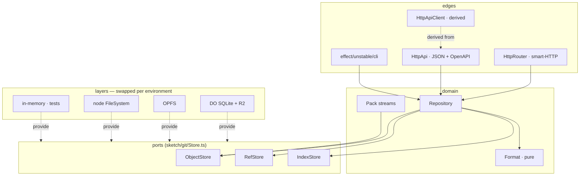

# Sketch: Effect v4 + alchemy@next rewrite

Status: **design sketch**, not a migration. Nothing under `src/` is touched.

The code in [`sketch/`](../sketch) is illustrative, but it is not hand-waved: it
typechecks against the real `effect@4.0.0-beta.107` and `alchemy@2.0.0-beta.70`
type definitions (`tsc --noEmit`, strict, no `any` escapes). Bodies that would
just be ported code are `declare const` stubs, so the shapes and the wiring are
checked while the git internals stay out of the way. The dependencies are not
added to `package.json` — the check was run against a scratch install.

Typechecking it rather than eyeballing it was worth doing: it caught four
design errors that read fine on the page, all noted below — including one in
this sketch's own layering.

Pinned against what actually exists today:

| package                  | version           | notes                                                     |
| ------------------------ | ----------------- | --------------------------------------------------------- |
| `effect`                 | `4.0.0-beta.107`  | `Schema`, `HttpApi`, `Stream`, CLI all in core now         |
| `alchemy`                | `2.0.0-beta.70`   | the `next` tag; v2 is "infrastructure as effects"          |
| `@effect/platform-node`  | `4.0.0-beta.107`  | node `FileSystem`/`Path`/`NodeRuntime` for the CLI         |

Both are betas with breaking changes between releases. That is the single
biggest cost item below.

---

## Why bother

Four things in the current code are structural, not stylistic — they are the
argument for the rewrite. Everything else is taste.

**1. A push can take the isolate out.** `GitPackParser.parsePack` reads the
whole request body into one `Uint8Array` before it validates the header
(`src/git.pack.ts:547`). A Durable Object gets 128 MiB. Today a push of a repo
with a few large blobs OOMs, and the failure mode is an isolate reset, not an
error the client can read. The upload-pack side has the mirror problem: the
object walk completes into an array before the first byte goes out.

**2. Errors are strings by the time they matter.** `GitError` carries a `code`
and handlers rediscover meaning with `instanceof` at ~40 sites; `worker.ts` and
`server.api.ts` each map errors to statuses with their own logic. Nothing tells
a caller of `repository.commit(...)` that a ref conflict is possible.

**3. Cancellation stops at the door.** `request.signal?.throwIfAborted()` runs
once in `worker.ts` and once in `Server.fetch`. Below that, an aborted clone
keeps walking objects, keeps reading R2, and keeps paying for it.

**4. Three storage implementations, one of them lying.** `GitStorage` is a
16-method filesystem interface with `applyRefChanges?` marked optional. Only the
Cloudflare implementation provides it, so the browser client hand-rolls
read-then-write ref updates (`client.ts#writeRefIfUnchanged`) and races itself
across tabs. Callers branch on whether a method exists.

Effect addresses 1–3 directly. The port split addresses 4. Alchemy addresses a
smaller, separate problem: three sources of truth (`wrangler.json`, the
generated `worker-configuration.d.ts`, and `worker.ts`'s hand-written binding
lookup) for one binding.

---

## What does not change

`git.object.ts`, `git.delta.ts`, `git.index.ts`, `git.merge.ts`, `git.utils.ts`
— 2,351 lines of pure, synchronous byte work with no I/O. Effect buys nothing
there and costs an allocation per call. They port over with two edits: functions
that `throw` return a `Result`, and anything that reached for storage moves up
into `Repository`. See [`sketch/git/Format.ts`](../sketch/git/Format.ts) — that
file is the seam, pure below and effectful above.

Being explicit about this is what keeps the rewrite from being a rewrite of
everything: a sixth of the non-test code moves across untouched, and it happens
to be the part with the subtlest bugs.

---

## Shape

The point of the diagram is the dotted lines. `Repository` and both HTTP edges
name only the three ports and `RepoHost`, so the same program runs in the DO, on
node, in the tab, in the CLI and in a test. Today that same program is written
three times.

### Module map

| today                                          | lines | becomes                                   |
| ---------------------------------------------- | ----: | ----------------------------------------- |
| `git.error.ts`                                 |    50 | `git/Error.ts` — `Schema.TaggedError` union |
| `git.storage.ts` + 3 implementations           | 1,192 | `git/Store.ts` + one layer per environment |
| `git.repository.ts`                            |   874 | `git/Repository.ts` service                |
| `git.pack.ts`, `git.protocol.ts`               | 1,153 | `git/Pack.ts` — `Stream`/`Channel`         |
| `git.object|delta|index|merge|utils.ts`        | 2,351 | ported as-is behind `git/Format.ts`        |
| `git.hooks.ts`                                 |   163 | `Hooks` service                            |
| `server.ts` (DO + routing)                     | 1,130 | `server/App.ts` + `host/*` (~200)          |
| `server.api.ts`                                | 2,515 | `server/Api.ts` — one `HttpApi` decl       |
| `server.webhooks.ts`                           |   257 | `server/Webhooks.ts` — a `Schedule`        |
| `server.lfs.ts`, `server.storage.ts`           |   981 | folded into the R2 layer                   |
| `client.ts`                                    | 1,007 | `Repository` + derived client (~250)       |
| `cli.ts`                                       | 1,991 | `cli/main.ts` — `Command` tree (~350)      |
| `worker.ts` + `wrangler.json`                  |    32 | `alchemy.run.ts` + `host/Cloudflare.ts`    |

13,819 non-test lines today. The plausible landing zone is 7–8k: the savings are
concentrated in `server.api.ts` (schema replaces hand validation and hand
dispatch), `cli.ts` (the CLI framework replaces the argv parser), and `client.ts`
(the derived client replaces re-declared payload types). The domain code barely
moves.

---

## Mechanics

### Errors

[`sketch/git/Error.ts`](../sketch/git/Error.ts). Six `Schema.TaggedError`
classes replace six `Error` subclasses. Being schema-backed is what matters:
the same class is the server's failure, the wire representation, and the type
the browser client matches on. `RefConflict` arrives at the client as
`{ _tag: "RefConflict", ref, expected, actual }`, not as a 409 whose body has a
`code` string the client re-parses.

The status mapping lives once, on the error, and is total by construction —
`worker.ts`'s catch block and `server.api.ts`'s per-handler `try`/`catch` both
disappear.

### Ports

[`sketch/git/Store.ts`](../sketch/git/Store.ts). Three narrow services addressed
by git concepts (`read(oid)`), not paths (`readFile(".git/refs/heads/main")`).
`RefStore.apply` is the only writer and is transactional, with `atomic` as a
parameter — so receive-pack's atomic mode stops being a separate code path, and
OPFS and node have to answer for atomicity instead of silently omitting it.

`ObjectStore` has both `read` and `readStream`. The Cloudflare layer
([`sketch/adapters/Cloudflare.ts`](../sketch/adapters/Cloudflare.ts)) maps
`readStream` onto R2's body stream and `writeStream` onto `bucket.put(stream)`,
which alchemy's binding accepts directly — a large blob never materializes.

### Streaming

[`sketch/git/Pack.ts`](../sketch/git/Pack.ts). Pack parse becomes a `Stream`
transformation that writes each object through to storage as it resolves, so
only the delta base window is resident. Pack write is a lazy `Stream` handed to
`HttpServerResponse.stream`, so first-byte latency drops to the first object and
a client hang-up interrupts the walk.

pkt-line framing becomes a `Channel`, which means a truncated frame is a typed
`PackCorrupt` rather than a read that blocks forever.

Two constraints the typechecker made explicit here, both worth knowing before
phase 3 starts. A response body outlives the handler effect, so it cannot carry
requirements: `Repository.pack` closes over its own stores and hands back a
plain `Stream`, which is what lets it go straight to `HttpServerResponse`. And
R2's `put` only accepts an uncoloured stream, so a request body streamed into
storage must already be free of platform requirements. Both would have been
silent runtime surprises in a hand-written port.

### Concurrency and lifetime

- Ref updates: optimistic CAS with a retry `Schedule` on `RefConflict`
  ([`Repository.commit`](../sketch/git/Repository.ts)), rather than each caller
  reinventing read-then-write.
- Per-ref `update` hooks run concurrently; one rejection interrupts the siblings.
- `post-receive` / webhooks fork and are handed to `state.waitUntil`
  ([`sketch/server/Webhooks.ts`](../sketch/server/Webhooks.ts)), so a slow
  subscriber no longer adds its latency to the push.
- Webhook backoff is `Schedule.exponential |> jittered |> recurs(4)` — the same
  policy that today is a `for` loop, but now assertable under `TestClock`.
- Every fiber is tied to the request, so abort propagates all the way down.

### HTTP

Two edges, deliberately:

- **Smart-HTTP** ([`sketch/server/Protocol.ts`](../sketch/server/Protocol.ts))
  stays byte-oriented on `HttpRouter`. A schema buys nothing on a packfile.
- **JSON API** ([`sketch/server/Api.ts`](../sketch/server/Api.ts)) becomes one
  `HttpApi` declaration. From it: typed handlers, a derived client for both
  `client.ts` and the CLI, and `/api/openapi.json`. The 45 endpoint tables in
  `readme.md` become generated output.

Both mount into one `HttpRouter.toWebHandler(...)` in
[`sketch/server/App.ts`](../sketch/server/App.ts), which no host-specific code
touches.

One thing the group prefix `/api/:repo` forces: the `repo` path parameter has to
be declared in each endpoint's `params` schema. Leave it out and the server
still compiles — it is the *derived client* that fails, because it cannot build
a URL for a segment nobody described. Worth knowing early, since it is the kind
of thing that gets discovered at the end of a mechanical port of 45 endpoints.

### Portability

There is no provider-neutral `Alchemy.Worker` or `Alchemy.DurableObject` to
reach for. In alchemy@next both are Cloudflare resources —
`Alchemy.Worker(...)` and `Alchemy.DurableObject(...)` come from
`alchemy/Cloudflare`, which is what [`sketch/alchemy.run.ts`](../sketch/alchemy.run.ts)
and [`sketch/host/Cloudflare.ts`](../sketch/host/Cloudflare.ts) import. What
alchemy *does* offer across providers is the request shape: a Worker's `serve`
and `alchemy/Http`'s `NodeHttpServer` / `BunHttpServer` take the same
`HttpEffect`.

So portability is not a framework feature to switch on — it is one file,
[`sketch/host/Host.ts`](../sketch/host/Host.ts), naming the three things a git
server actually needs from a host:

| capability  | why it exists                                   | Cloudflare                  | node / bun            |
| ----------- | ----------------------------------------------- | --------------------------- | --------------------- |
| `stores`    | one repository's objects and refs               | R2 + DO SQLite              | a directory           |
| `serialize` | two pushes to a ref must not interleave the CAS | the DO input gate (nothing) | a `Semaphore` per repo |
| `background`| webhook delivery outliving the response         | `state.waitUntil`           | `Effect.forkDetach`   |

Above that line — `server/*`, `git/*` — nothing names a provider; `grep -l
alchemy sketch/` hits only `host/`, `adapters/Cloudflare.ts` and the stack file.

The unit that moves between hosts is **one app instance bound to one
repository** ([`App.forRepo`](../sketch/server/App.ts)). That is not an
arbitrary choice: `Repository` is *constructed* from `ObjectStore` and
`RefStore`, so storage resolves when the layer is built, not when a request
arrives — which is exactly the Durable Object model. Cloudflare gets an instance
per repo from the platform; [`host/Node.ts`](../sketch/host/Node.ts) reproduces
it with a `Map` keyed by repo name and a lock around dispatch.

The node host is worth having on its own merits, provider story aside: `npm run
dev` and the e2e suite stop spawning `wrangler dev` on port 8080
(`test.helpers.ts` does today), self-hosting becomes a supported shape rather
than a fork, and the CLI can run the server in-process.

### Infrastructure

[`sketch/alchemy.run.ts`](../sketch/alchemy.run.ts). `Alchemy.R2.Bucket` and
`Alchemy.DurableObject` are values in the same program that uses them;
`Cloudflare.R2.ReadWriteBucket(Objects)` yields the binding, the env var and the
typed client from one call. That deletes `wrangler.json`, the generated
`worker-configuration.d.ts`, and the `postinstall` codegen step.

What it adds beyond parity: `--stage` previews (a full stack per PR, destroyed
on close) and a local runtime that runs the same program against emulated R2/DO
— so `test.helpers.ts` stops spawning `wrangler dev` on port 8080 for the e2e
suite.

### Tests

[`sketch/testing/Repository.sketch.ts`](../sketch/testing/Repository.sketch.ts). `@effect/vitest`,
environment as a layer swap, `HttpApiTest` driving the real handler in-process.
`--test-concurrency=1` and the global setup file both go away. The 9,125 lines
of existing tests are the main asset in this repo and most of them port
mechanically — the assertions are about git behaviour, not about plumbing.

---

## Migration

Each phase ships on its own and keeps `src/` working. The existing test suite is
the ratchet: it runs against both implementations until the last phase.

| phase | scope                                                                | risk   |
| ----- | -------------------------------------------------------------------- | ------ |
| 0     | add deps, `Format.ts` seam, port pure modules unchanged, dual-run tests | low    |
| 1     | `Error.ts` + `Store.ts` ports; in-memory layer; keep old classes as adapters over the new ports | low |
| 2     | `Repository` service; re-point `server.ts` at it (still a DO class)   | medium |
| 3     | `Pack.ts` streaming; this is where the OOM and the abort bugs get fixed | high  |
| 4     | `HttpApi` for the JSON API; derive the client; delete duplicated types | medium |
| 5     | `RepoHost` seam + alchemy stack; delete `wrangler.json` + codegen; preview stages | medium |
| 5b    | node host — drops `wrangler dev` from `npm run dev` and the e2e suite  | low    |
| 6     | CLI on `effect/unstable/cli`; delete the argv parser                   | low    |

Phase 3 is the one worth doing even if the rest is deferred — it is the only
phase that fixes a bug users can hit. Phase 5b is the cheapest thing on the
list once 5 lands, and it pays for itself in test runtime.

---

## Costs and open questions

- **Both dependencies are betas.** `effect@4.0.0-beta.107` and
  `alchemy@2.0.0-beta.70` both break between releases. Pinning exactly (the repo
  already sets `save-exact=true`) and budgeting for churn per upgrade is the
  honest plan; the alternative is waiting for stable and doing phase 3 by hand.
- **Bundle size in a Worker.** Effect core plus `unstable/http` plus
  `unstable/httpapi` is not small. Needs a measurement against the 3 MiB
  (compressed) limit before phase 4, not after.
- **The edges were reaching past the domain — caught by the types.** The first
  version had `Api.ts` and `Protocol.ts` doing `yield* RefStore` directly.
  That compiles, but it makes storage a *per-request* requirement of every
  route, so `toWebHandler` demanded a `Context<ObjectStore | RefStore>` on every
  call and no host could bind an app instance to a repository. Routing those
  reads through `Repository` (`refs`, `resolve`, `head`, `branch`, `pack`, and
  `receive` taking the pack stream) fixed the requirement and tightened the
  layering: the HTTP edges now know about one service, not three. Worth
  remembering during phase 4, when 45 endpoints get ported and the shortcut is
  tempting each time.

- **`RuntimeContext` colouring — resolved, with a cost.** Alchemy's Cloudflare
  bindings return effects requiring `RuntimeContext` (it holds the invocation's
  `env`/`ExecutionContext`). The first version of this sketch threaded it
  through the port signatures; the typechecker then dragged it into the CLI and
  the test suite, neither of which runs on Workers. The fix is that the
  Cloudflare layer captures the context with `Effect.context` and provides it
  inward ([`adapters/Cloudflare.ts`](../sketch/adapters/Cloudflare.ts)), so the
  ports stay `R = never`. The cost is real and should be measured: that layer
  must be built inside the invocation rather than memoized per DO instance,
  because a cached context would pin a stale `ExecutionContext`.
- **Delta resolution against a stream.** `OFS_DELTA` bases are addressed by
  offset into the pack. Streaming means keeping a bounded window plus a
  second pass for misses — this is the one place the sketch is hand-waving
  (`decodeObjects` is a `declare`), and it deserves a spike before committing to
  phase 3.
- **Effect v4 has no `Effect.Service` class helper.** Services are
  `Context.Service<Self, Shape>()("key")` plus `Layer.effect`. Slightly more
  ceremony than v3 examples on the web suggest; the sketch uses the real v4 form
  throughout.
- **Rough size.** Phases 0–2 are a couple of weeks of focused work; 3 is the
  spike-plus-a-week; 4–6 are mostly mechanical but touch every test. Call it
  6–8 weeks end to end at part-time attention, with the repo shippable at every
  phase boundary.
