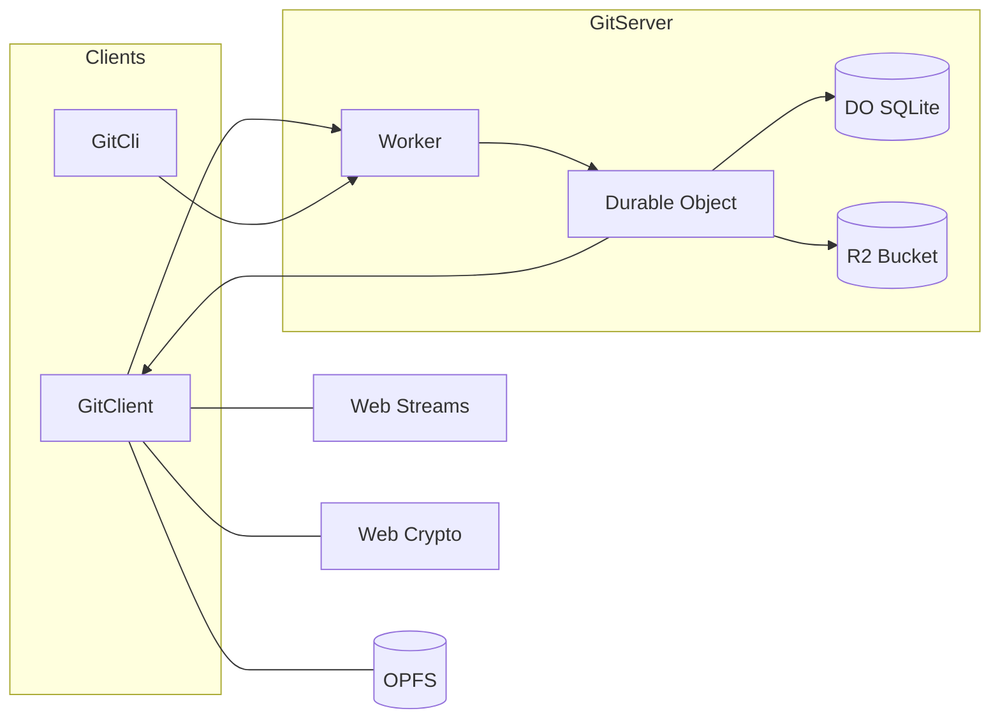

> [!WARNING]  
> Experimental: API is unstable and not production-ready.

# @chr33s/git

Implements the native Git Server, Client, Cli smart-HTTP protocol for fetch and push with modern TypeScript, Web Streams, and modern Web APIs.

## Prerequisites

- Node.js 24+ and npm 11+

## Architecture

Native `GitServer` smart-HTTP protocol deployed at the edge, in‑browser `GitClient` and `GitCli`. Cloudflare Worker entrypoint that routes requests to a per‑repo Durable Object. Refs/trees/commits are kept in DO SQLite; large blobs live in R2. In the browser using standard Web APIs.



## GitServer: Git over HTTP

### Stack

- Cloudflare Workers runtime
- Durable Objects with built‑in SQLite for refs, commits, trees, and tags
- Cloudflare R2 for Git object blobs (file contents)

### HTTP API

- Service discovery: `GET /:repo/info/refs?service=git-{upload,receive}-pack`
- Upload‑pack (fetch): `POST /:repo/git-upload-pack`
- Receive‑pack (push): `POST /:repo/git-receive-pack`

See `src/index.ts` for routing and bindings.

## GitClient: Git in the browser

`GitClient` provides Git protocol functionality using only Web standards:

- `fetch()` for HTTP
- Web Streams for efficient data processing
- Web Crypto API for SHA‑1 hashing
- TextEncoder/TextDecoder for string/binary conversion
- OPFS (Origin Private File System) for file checkout

### Features

- Repository operations: info/refs, clone/fetch, create Git objects (blob, tree, commit)
- Full pack‑file handling for upload‑pack and receive‑pack
- Browser‑first: uses Web APIs end‑to‑end
- OPFS integration: automatic checkout to the browser’s private filesystem with repo‑based directory caching

### API

```ts
import { Client } from "@chr33s/git/client";

const client = new Client({ name: "my-repo" });
```

#### Repository

| Method                       | Description                                 |
| ---------------------------- | ------------------------------------------- |
| `init()`                     | Initialize a new repository                 |
| `clone(url)`                 | Clone a remote repository                   |
| `remote(action, name, url?)` | Manage remotes (`add`, `remove`, `set-url`) |
| `getAllRemotes()`            | List all configured remotes                 |
| `getRemote(name)`            | Get URL for a specific remote               |

#### Staging & Commits

| Method                 | Description                              |
| ---------------------- | ---------------------------------------- |
| `add(path)`            | Stage a file                             |
| `rm(paths, opts?)`     | Remove files (`--cached`, `--recursive`) |
| `mv(old, new)`         | Move/rename a staged file                |
| `restore(path)`        | Restore file from HEAD                   |
| `commit(msg, author?)` | Create a commit                          |
| `status()`             | Get staged, modified, untracked files    |

#### History & Inspection

| Method      | Description               |
| ----------- | ------------------------- |
| `log()`     | List commit history       |
| `show(ref)` | Show object by ref or OID |

#### Branching & Merging

| Method             | Description                    |
| ------------------ | ------------------------------ |
| `branch(name?)`    | Create branch or list branches |
| `checkout(ref)`    | Check out a ref/commit         |
| `switch(name)`     | Switch to an existing branch   |
| `merge(ref)`       | Merge a branch into current    |
| `rebase(onto)`     | Rebase current branch onto ref |
| `reset(hard, ref)` | Reset to a commit              |
| `tag(name)`        | Create a lightweight tag       |

#### Remote Sync

| Method                           | Description                         |
| -------------------------------- | ----------------------------------- |
| `fetch(remote?)`                 | Fetch from remote (default: origin) |
| `pull(remote?, branch?)`         | Fetch and merge                     |
| `push(remote?, branch?, force?)` | Push to remote                      |
| `pushDelete(remote?, branch)`    | Delete remote branch                |

### Browser compatibility

- Chrome/Edge: 86+
- Firefox: 111+
- Safari: 15.2+

## GitCli: Git in the terminal

`GitCli` provides a command-line interface that mirrors native Git commands, built on top of `GitClient`.

### Usage

```sh
npx @chr33s/git <command> [options]
```

### Commands

| Command    | Description                                      |
| ---------- | ------------------------------------------------ |
| `init`     | Initialize a new repository                      |
| `clone`    | Clone a repository from URL                      |
| `add`      | Add file contents to the index                   |
| `rm`       | Remove files from the working tree and index     |
| `mv`       | Move or rename a file                            |
| `restore`  | Restore working tree files                       |
| `commit`   | Record changes to the repository                 |
| `status`   | Show the working tree status                     |
| `log`      | Show commit logs                                 |
| `show`     | Show various types of objects                    |
| `branch`   | List, create, or delete branches                 |
| `checkout` | Switch branches or restore working tree files    |
| `switch`   | Switch to a branch                               |
| `merge`    | Join two or more development histories together  |
| `rebase`   | Reapply commits on top of another base tip       |
| `reset`    | Reset current HEAD to the specified state        |
| `tag`      | Create, list, or delete tags                     |
| `fetch`    | Download objects and refs from a remote          |
| `pull`     | Fetch from and integrate with a remote           |
| `push`     | Update remote refs along with associated objects |
| `remote`   | Manage set of tracked repositories               |

## Development

```sh
# dev
npm install
npm run check   # run lint/format checks (use: npm run fix)
npm test        # run unit tests
npm run dev

# prod
npm run build
npm run deploy
```

### Testing

Unit tests use Node.js built-in test runner and cover individual functions and components:

```sh
npm test
```

The E2E tests automatically start the development server and test the Git smart-HTTP protocol endpoints.
