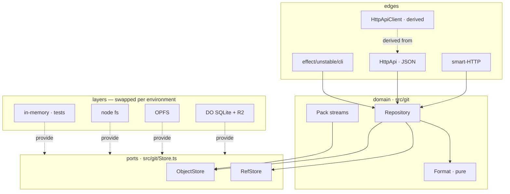

> [!WARNING]  
> Experimental: API is unstable and not production-ready.

# @chr33s/git

Universal Git smart-HTTP protocol server, browser client & unix CLI — built on
[Effect](https://effect.website) v4 with modern TypeScript and Web APIs.

One implementation of git's core runs everywhere: in a Cloudflare Durable
Object, on plain node, in a browser tab, and in a terminal. Stock `git` clones
from it and pushes to it, and reads the index and history its own commands
write.

This document is the whole of the project's documentation — architecture,
conventions, testing philosophy, and what is deliberately absent. Read the
[Architecture](#architecture) and [Conventions](#conventions) sections before
your first change; they explain constraints the code cannot show you.

- [Prerequisites](#prerequisites)
- [Quick start](#quick-start)
- [Architecture](#architecture)
- [Why it is built this way](#why-it-is-built-this-way)
- [Conventions](#conventions)
- [Testing](#testing)
- [Surfaces](#surfaces)
- [Deliberately not built](#deliberately-not-built)
- [Open questions](#open-questions)
- [Development](#development)

## Prerequisites

- Node.js 24+ and npm 11+
- `git` on `PATH` — the interop tests drive the real binary, and skip without it
- Chromium via Playwright, optional (the real-browser test skips without it)

Both `effect` and `alchemy` are pinned betas that break between releases; the
repo sets `save-exact=true` deliberately.

| package                 | version          | why it matters                                     |
| ----------------------- | ---------------- | -------------------------------------------------- |
| `effect`                | `4.0.0-beta.107` | `Schema`, `HttpApi`, `Stream` and the CLI are core |
| `alchemy`               | `2.0.0-beta.70`  | the `next` tag; v2 is "infrastructure as effects"  |
| `@effect/platform-node` | `4.0.0-beta.107` | node `FileSystem`/`Path`/`NodeRuntime` for the CLI |

`alchemy` is installed behind a `patch-package` patch, and `effect` behind one
that aliases `Schema.TaggedErrorClass` — the name a dependency is built
against. The alias is not a project convention; see
[Effect v4 in this repo](#effect-v4-in-this-repo).

## Quick start

```sh
npm install                               # postinstall applies patches/ and regenerates worker types
GIT_ROOT=repos node src/host/Node.ts      # or: npx wrangler dev
git clone http://127.0.0.1:8080/my-repo
```

The CLI drives the same code the server runs — one `Repository`, one host, one
client, one auth path:

```sh
npx chr33s-git init my-repo && npx chr33s-git serve --secret s3cret &
npx chr33s-git token my-repo --secret s3cret --scope write
npx chr33s-git clone --token <token> http://127.0.0.1:8080/my-repo my-copy
```

Working-tree commands take `--work`, a checkout whose repository is `.git`
inside it, rather than the bare repositories under `--root`:

```sh
npx chr33s-git add --work . . && npx chr33s-git status --work .
npx chr33s-git commit --work . --message "first"
npx chr33s-git switch --work . --create topic
```

## Architecture

### Ports and adapters

`Repository` — commits, trees, refs, log — is one service written against two
storage ports. Every environment is a layer swap underneath it.


```mermaid
flowchart TB
	subgraph ports["ports · src/git/Store.ts"]
		OS[ObjectStore]
		RS[RefStore]
	end

	subgraph domain["domain · src/git"]
		REPO[Repository]
		PACK[Pack streams]
		FMT[Format · pure]
	end

	subgraph edges["edges"]
		PROTO[smart-HTTP]
		API[HttpApi · JSON]
		CLI[effect/unstable/cli]
		CLIENT[HttpApiClient · derived]
	end

	subgraph layers["layers — swapped per environment"]
		CF[DO SQLite + R2]
		OPFS[OPFS]
		NODE[node fs]
		MEM[in-memory · tests]
	end

	PROTO --> REPO
	API --> REPO
	CLI --> REPO
	CLIENT -.derived from.-> API
	REPO --> OS & RS
	REPO --> FMT
	PACK --> OS
	CF & OPFS & NODE & MEM -.provide.-> ports
```

The dotted lines are the point. `Repository` and both HTTP edges name only the
ports, so the same program runs in the Durable Object, on node, in a tab, in
the CLI and in a test.

**Do not reach past the domain.** An early version had `Api.ts` and
`Protocol.ts` doing `yield* RefStore` directly. It compiles — and it makes
storage a _per-request_ requirement of every route, so `toWebHandler` demands a
`Context<ObjectStore | RefStore>` on every call and no host can bind an app
instance to a repository. Route reads through `Repository`. The shortcut is
tempting each time the JSON surface grows.

### One Durable Object per repository

Not an arbitrary mapping: the DO's input gate provides the serialization that
`RefStore.apply`'s compare-and-swap demands. The filesystem backend buys the
same guarantee with `rename(2)`; the node host stands in for the input gate
with a per-repository mutex, and for instance isolation with one cached layer
per repository name.

### The pure/effectful seam

`src/git/Format.ts` is the seam — pure below, effectful above. Byte work with
no I/O (framing, commit and tree codecs, hashing, delta application, the index
codec) stays synchronous: Effect buys nothing there and costs an allocation per
call. Functions that would throw return a `Result`; anything that reaches for
storage moves up into `Repository`.

### Module map

| module                       | what it is                                                           |
| ---------------------------- | -------------------------------------------------------------------- |
| `src/git/Error.ts`           | tagged errors with `httpApiStatus` annotations                       |
| `src/git/Store.ts`           | `ObjectStore` / `RefStore` ports                                     |
| `src/git/Format.ts`          | the pure/effectful seam — framing, commit and tree codecs, hashing   |
| `src/git/Repository.ts`      | the domain service                                                   |
| `src/git/Memory.ts`          | in-memory backend                                                    |
| `src/git/Node.ts`            | filesystem backend, git's own on-disk layout                         |
| `src/git/Cloudflare.ts`      | R2 + Durable Object SQLite backend                                   |
| `src/adapters/Opfs.ts`       | browser (OPFS) backend — same loose-object layout                    |
| `src/git/Durable.ts`         | the Worker entry: one Durable Object per repository                  |
| `src/git/Pack.ts`            | streaming packfile transport, platform-neutral, git-interop-tested   |
| `src/git/PackFile.ts`        | random access into a pack at rest, via `PackIndex.ts`'s `.idx` codec |
| `src/git/Packed.ts`          | `PackStore` port; decorates an `ObjectStore` with packed reads       |
| `src/git/Inflate.ts`         | pull-based zlib inflate — exact stream boundaries, no `node:*`       |
| `src/git/Diff.ts`            | unified diff, byte-identical to `git diff --no-index`                |
| `src/git/Merge.ts`           | three-way merge, byte-identical to `git merge-file --diff3`          |
| `src/git/Index.ts`           | git's own `DIRC` v2 index codec                                      |
| `src/git/Work.ts`            | `WorkTree` / `IndexStore` ports; `Checkout.ts` is the porcelain      |
| `src/git/Rebase.ts`          | replay: cherry-pick, and rebase as a sequence of them                |
| `src/git/Bisect.ts`          | which commit first broke it, as a function of the good/bad marks     |
| `src/git/History.ts`         | `git log -- <path>`, history simplification included                 |
| `src/server/Protocol.ts`     | git smart-HTTP: advertisement, upload-pack, receive-pack, v0 and v2  |
| `src/server/Api.ts`          | JSON API as one `HttpApi` declaration; the client derives from it    |
| `src/server/Route.ts`        | URL → repository name, in one place; strips the `.git` suffix        |
| `src/server/Auth.ts`         | scoped tokens: guard on both surfaces, HMAC or revocable verifiers   |
| `src/server/Webhooks.ts`     | signed push delivery: `Schedule` retry, backgrounded, per-subscriber |
| `src/server/Lfs.ts`          | Git LFS batch API and transfer, per-platform streaming digest        |
| `src/server/Archive.ts`      | tree → tar / tar.gz / zip, streamed                                  |
| `src/server/CommitPack.ts`   | NDJSON bulk commit, parsed as a stream                               |
| `src/server/Remotes.ts`      | named remotes; `Remotes.node.ts` is the JSON-file store              |
| `src/host/Node.ts`           | node host: the same handlers behind `node:http`, self-hostable       |
| `src/host/Cloudflare.ts`     | the Workers host                                                     |
| `src/client/Fetch.ts`        | smart-HTTP fetch client: `lsRemote`, clone, incremental fetch        |
| `src/client/Push.ts`         | smart-HTTP push client                                               |
| `src/client/Client.ts`       | browser client: derived JSON client, clone, local `Repository`       |
| `src/cli/main.ts`            | CLI: 29 commands, `npx chr33s-git`                                   |
| `src/artifacts/Namespace.ts` | local Cloudflare Artifacts provider over alchemy's binding tag       |
| `src/artifacts/Sqlite.ts`    | the provider's registry + tokens on Durable Object SQLite            |
| `src/alchemy.run.ts`         | deployment stack: bucket, DO and Worker as values, not config        |
| `src/git/Store.contract.ts`  | one storage contract suite, run against all four backends            |

## Why it is built this way

This is a ground-up rewrite of an earlier implementation. Four problems in that
code were structural rather than stylistic, and they are the whole argument:

1. **A push could take the isolate out.** The pack parser read the entire
   request body into one `Uint8Array` before validating the header. A Durable
   Object gets 128 MiB, so a push of a repo with a few large blobs OOM'd — and
   the failure mode was an isolate reset, not an error the client could read.
   Upload-pack had the mirror problem: the object walk completed into an array
   before the first byte went out. Everything here streams instead.

2. **Errors were strings by the time they mattered.** A `code` field, and
   handlers rediscovering meaning with `instanceof` at ~40 sites, with two
   separate error-to-status mappings. Nothing told a caller of
   `repository.commit(...)` that a ref conflict was possible. Now every failure
   is in the type, and its status comes from its own annotation.

3. **Cancellation stopped at the door.** One `throwIfAborted()` at the top;
   below it, an aborted clone kept walking objects and kept paying for it.

4. **Three storage implementations, one of them lying.** A 16-method interface
   with `applyRefChanges?` optional, provided only by Cloudflare — so the
   browser client hand-rolled read-then-write ref updates and raced itself
   across tabs. Callers branched on whether a method existed. The port split
   fixes this: `RefStore.apply` is compare-and-swap on every backend, and one
   contract suite proves it.

Effect addresses 1–3 directly; the port split addresses 4. Alchemy addresses a
smaller, separate problem: three sources of truth (`wrangler.json`, the
generated types, and a hand-written binding lookup) for one binding.

## Conventions

### Errors

`Schema.TaggedError` classes in `src/git/Error.ts`, each carrying an
`httpApiStatus` annotation. A `RefConflict` crosses the wire as
`{ "_tag": "RefConflict", ref, expected, actual }` with its status read from
the class, not from a mapping table. Do not hand-roll `_tag` classes, and do
not add a status field.

### Ports and layers

`Context.Service<Self, Shape>()("key")` plus `Layer.effect`/`Layer.sync`
returning `Service.of({ … })`. Effect v4 has no `Effect.Service` class helper.

A port with no caller is dead code — but so is a codec with no port. Both
halves of that rule have been load-bearing here; see
[Deliberately not built](#deliberately-not-built).

The storage ports are traced by one decorator rather than per-method edits:
`tracedObjectStore` and `tracedRefStore` wrap an implementation, so span names
live in one place and a new backend cannot forget to name itself. A trace reads
`Repository.commit → Cloudflare.RefStore.apply` whichever storage is loaded.

### Streaming

`Stream`/`Channel` end to end. Nothing reads a request body whole; nothing
collects an object walk before the first byte goes out. `Repository.unpack`
writes objects to the store as they resolve, so an `OFS_DELTA` base is re-read
by oid from storage and only the object being decoded is resident — no window,
no second pass.

Handlers that consume large bodies must be dispatched _before_ anything that
would buffer them. In both hosts, LFS and `commit-pack` are tried ahead of the
JSON API for exactly this reason.

### Concurrency and lifetime

`RcMap` for reference-counted per-repository instances (a plain `Map` leaked —
every repository ever touched stayed resident on the node host).
`PartitionedSemaphore` is _not_ a per-key mutex: its permits are capacity
shared across keys. The node host uses a per-repository promise chain.

### HTTP

`HttpApi` declares the JSON surface once; the client is derived from that
declaration rather than re-declaring payload types. Handler requirements are
request-scoped and resolved from what the app layer _outputs_, which is why
hosts compose with `Layer.provideMerge` rather than `Layer.provide`.

### Portability

No `node:*` in anything below `host/` or the `*.node.ts` files. Platform
specifics live in per-platform modules — `Lfs.node.ts` / `Lfs.cloudflare.ts`,
`Subscribers.node.ts`, `Work.node.ts`, `Remotes.node.ts` — following the same
naming convention. `Inflate.ts` exists because `node:zlib` does not.

Alchemy's Cloudflare bindings return effects requiring `RuntimeContext`. Do not
thread it through port signatures: the typechecker will drag it into the CLI
and the test suite, neither of which runs on Workers. The Cloudflare layer
captures it with `Effect.context` and provides it inward, so ports stay
`R = never`. The cost is that the layer must be built inside the invocation
rather than memoized per instance — a cached context would pin a stale
`ExecutionContext`.

### Effect v4 in this repo

Read `.claude/skills/effect` before writing Effect code. Points that have
actually bitten:

- `Effect.catch`, not `catchAll`. `Effect.ignore`, not `ignoreLogged`.
  `Schema.Literals([...])`. There is no `Stream.mapConcat` — use
  `Stream.flatMap`.
- `Config`, not `process.env`, in application logic. A malformed `PORT` should
  fail naming the variable, not silently become `NaN`.
- Effect `HttpClient` for outgoing calls. `HttpClient.retryTransient`'s
  built-in classification (transport errors, timeouts, 408, 429, 5xx — and
  _not_ other 4xx) is the policy hand-rolled predicates reach for.
- `Effect.fn("Domain.operation")` on public and non-trivial operations, so a
  push or fetch shows its cost where it is spent.
- Do not use `as any`, non-null assertions, or casts to silence typing
  problems. Sixteen such assertions were removed here; deleting them made the
  compiler name the two that were load-bearing, and those carry a
  line-scoped diagnostic suppression _and a reason_.

Three deviations are deliberate: `Schema.TaggedError` rather than
`TaggedErrorClass` (the pinned beta exports the former); raw `fetch` in
`client/Fetch.ts` because it is the browser transport, with Effect discipline
kept inside the adapter; and no module-namespace re-export style, because the
existing style is consistent already.

## Testing

`npm test` runs both vitest projects — `unit` and `integration` (the workerd
harness). There is no separate `test:integration` script.

The governing rule: **verify against the real `git` binary wherever a claim is
about git.** A test that builds its own history and checks its own expectations
will agree with a bug. Two bugs on the working-tree branch were found only by
comparison with git, and neither would have failed a self-consistent test:

- `Repository.log` followed first parents only — indistinguishable from correct
  on a linear history, and silently omitting every commit that arrived by a
  merge on any other.
- The fetch client read exactly one pkt-line before the pack, while real
  `upload-pack` emits one `ACK` per recognised have. That surfaced only when
  the client was pointed at stock `git-http-backend`.

Four kinds of evidence, deliberately:

- **oids match real git** — the empty tree and `hello\n` are pinned to what
  `git hash-object` produces.
- **the repository is really a git repository** — `Node.interop.test.ts` writes
  one through the ports and has the binary read it: `fsck --strict`, `log`,
  `cat-file`, `ls-tree`, `show`.
- **the contract holds on the backend that ships** — `Store.contract.ts` runs
  against DO SQLite and R2 inside workerd, not against a mock.
- **behaviour matches git's, not our description of it** — `git status`
  porcelain, `git log -- <path>`, `git rev-list --bisect`, `git ls-files
--stage`, `verify-pack`.

Where git's answer is genuinely one of several equally good ones — bisect on an
even split — assert the property (`--bisect-all` distance is maximal), not
git's particular pick. Pinning a tie-break tests git's implementation detail,
not ours.

Use `it.live` for anything touching real HTTP, subprocesses, or a retry
schedule; `it.effect` otherwise. Prefer making a retry policy a parameter over
reaching for `TestClock`: `Webhooks.test.ts` passes a 1 ms base delay and
counts attempts against a real receiver, testing the schedule _and_ the HTTP
behaviour in one pass.

## Surfaces

### smart-HTTP

Protocol v0 and v2, shallow (`deepen`, `deepen-since`, `deepen-not`,
`--unshallow`), `side-band-64k` on both fetch and push, and incremental fetch
with `have` negotiation. Stock `git` clones, pushes, and fetches; `…/repo.git`
and `…/repo` are the same repository.

Negotiation speaks `multi_ack_detailed` on both sides: the client offers
haves in rounds of 32 up to a cap of 256, the server tags every common
commit (`ACK <oid> common`), and `ACK <oid> ready` ends the conversation the
moment `Repository.canServe` — git's `ok_to_give_up`, a budgeted walk from
each want down to the common set — proves a pack can be cut. The same
predicate is what makes protocol v2's `ready` honest rather than eager. A
client that never requests the capability gets baseline single-ACK, and
either way negotiation only narrows the pack: it never changes which objects
arrive.

### JSON API

One `HttpApi` declaration per repository, errors crossing as tagged values.
Covers content (`commit`, `commit-pack`, `blob`, `tree`, `files`, `file`,
`object`), history (`log`, `commits`, `diff`, `history`, `bisect`), refs
(`refs`, `branches`, `tags`, `reset`, `reflog`), rewriting (`merge`,
`cherry-pick`, `rebase`), search (`grep`), remotes (`remotes`, `fetch`,
`push`, `pull`), maintenance (`fsck`, `gc`), and webhook registration — which
is what makes a push deliver.

A repository can act as a client of another: remotes are registered per
repository with an optional credential that is _stored rather than sent_ (a
token in a request body is a token in an access log), and `pull` reports a
non-fast-forward as its own outcome rather than guessing whether a merge or a
rebase was wanted.

### Working tree

`status`, `add`, `rm`, `mv`, `restore`, `switch`, `commit`, over an index at
`.git/index` in git's own `DIRC` v2 format. Two ports rather than one:
`WorkTree` is what is on disk, `IndexStore` is what has been staged — a server
has neither, a CLI has both, and a browser could have the second without the
first.

Both implementations can be pointed at the same checkout. `chr33s-git status`
prints git's porcelain, `git status` reads the index we wrote, and
`git fsck --strict` accepts the history we commit.

The working-tree verbs are **not** on the HTTP API, and that is the one
boundary drawn on purpose: a bare server has no files, so serving `add` would
mean inventing a work tree behind the API. The server-side spelling is
`POST /:repo/commit-pack`, which streams an NDJSON body of file frames into a
commit without holding more than one file in memory.

### Auth

The deployed Worker always enforces scoped read/write tokens: `alchemy deploy`
reads `GIT_AUTH_SECRET` from the environment, binds it as a secret, and fails
the deploy if it is missing. The node host is open by default — pass
`serve({ verify })` to enforce. `git` presents the token as
`http://<token>@host/repo`.

## Deliberately not built

Recorded because the reasoning is worth more than the files would have been.

**A provider-neutral `RepoHost` seam.** The plan was one `App` value naming the
storage ports plus a host port supplying `stores`, `serialize` and
`background`. What shipped is two concrete hosts sharing `Protocol.handle` and
`Api.layer` directly. The seam was unnecessary: the handlers already require
nothing but `Repository`, so host-neutrality came free from the effect
requirements and an extra service would only have restated it. If a third host
ever needs the three capabilities as one value, the port is a twenty-line file
away.

**An `IndexStore` port — deferred, then built.** The argument for deferring was
that a port with no caller is dead code. That reasoning holds; what it missed
is that the situation was already the mirror image. The _codec_ had landed in
`git/Index.ts` — byte work the real `git` binary reads and writes, verified
both directions — with no service, no layer and no caller. A format
implementation with nothing on either side of it is not a port waiting for its
feature; it is a feature waiting for its port. `git/Work.ts` is the result, and
`IndexStore` came to about twenty lines over the codec, as predicted.

**Delta creation on the request path.** `createDelta` and an ofs-delta
sliding window live in the pack writer behind `PackOptions.deltify`, and only
`Maintenance.repack` turns it on: repack is background work whose output is
storage, so the window's CPU and pinned memory buy smaller packs at rest
without costing any fetch response its first byte. Repack also feeds the
writer `deltaOrder` — type-major, `pack_name_hash` over tree-entry names,
largest first — because a reachability walk emits a commit's blobs together,
which parks two versions of one file a whole commit apart and outside any
window. Live upload-pack responses
stay full-object until measurement says the wire savings justify serve-time
delta search — the worst case of not deltifying is a larger pack, never a
wrong one. Thin packs are read today (a `ref-delta` whose base is outside the
pack resolves from the store) but never written; writing them is the wire
half of this same trade, and additionally leans on the negotiated common set
for its bases.

## Open questions

- **Bundle size in a Worker is unmeasured.** Effect core plus `unstable/http`
  and `unstable/httpapi` is not small, and nothing has checked it against the
  3 MiB compressed limit. The one open question that could still force a design
  change.
- **Both dependencies are betas** and break between releases. Budget for churn
  per upgrade.
- **Delta compression on the wire** is the remaining protocol item:
  `multi_ack_detailed` landed on both sides, deltas are written at repack, and
  the open question is whether fetch responses should spend serve-time CPU on
  delta search (and thin packs) for the bandwidth back. Measure before
  building — `docs/multi-ack-delta-compression.md` holds the sketch.

### Cloudflare Artifacts provider

`src/artifacts/` implements alchemy's **Cloudflare Artifacts** binding locally
— Artifacts is "git for agents", so the protocol half was already done. The
architecture maps onto the contract almost line for line. What it needed beyond
the git core was a namespace registry, `fork`, and an auth system; the first
and third exist (`artifacts/Sqlite.ts`, `server/Auth.ts`).

## Development

```sh
npm run check             # format, lint, and typecheck (tsc -b --noEmit)
npm run fix               # auto-fix both
npm test                  # unit + integration (workerd) projects
npx wrangler dev          # run the Worker locally on port 8080
npx wrangler deploy       # deploy (the tested path)
```

`npm run check` must be green before a commit; the interop tests need `git` on
`PATH`.

### Remaining: the branch swap

This branch's work is not yet the repository default. The swap is a
repository-settings operation, not a code change, and it needs a human.

Prefer GitHub's branch **rename** over a force-push: renames retarget open PRs
and branch-protection rules and leave a redirect notice for existing clones.

**First, check that the branch being promoted carries the work.** A rename
cannot lose history, but it can promote the wrong history — `artifacts` sat at
a commit predating all of the gap-closing work, and renaming it would have made
the default a repository with no LFS, no merge and no protocol v2, with nothing
in the history to suggest anything had gone wrong.

```sh
git fetch origin artifacts
git ls-tree --name-only origin/artifacts \
  src/server/Lfs.ts src/git/Merge.ts src/server/Route.ts src/client/Push.ts src/git/Work.ts
```

Anything missing means the branch is not the one to promote. Then, in a quiet
window:

1. Freeze — merge or close PRs targeting `main`; announce the cutover.
2. Rename `main` → `legacy`. Existing clones keep working. Optionally tag the
   tip: `git tag legacy/final <sha> && git push origin legacy/final`.
3. Rename the rewrite branch → `main`. Renaming the default makes it the
   default automatically; otherwise set it in Settings.
4. Re-point branch protection, required checks, and any CI triggers or
   environments naming the old branches.
5. Tell contributors:
   ```sh
   git fetch origin --prune
   git branch -m main legacy         # if they had the legacy main checked out
   git checkout -b main origin/main
   ```
6. Archive stale branches cut from the legacy `main`; new work rebases onto the
   new `main`.

Fallback without a rename: `git push origin main:legacy`, flip the default
branch in Settings, then `git push origin <branch>:main`. Force-pushing over
`main` without flipping the default first orphans open PRs — avoid.
