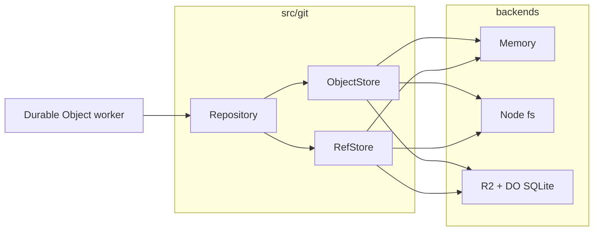

> [!WARNING]  
> Experimental: API is unstable and not production-ready.

# @chr33s/git

Universal Git smart-HTTP protocol server, browser client & unix cli — built on
[Effect](https://effect.website) v4 with modern TypeScript and Web APIs.

The repository is a ground-up rewrite in progress: the git core is real, tested
code; the servers and clients around it exist as typechecked design sketches.
See [`docs/rewrite.md`](./docs/rewrite.md) for the full plan and rationale.

## Prerequisites

- Node.js 24+ and npm 11+
- `git` on `PATH` (the interop tests drive the real binary)

## Architecture

The core is ports and adapters. `Repository` — commits, trees, refs, log — is
one service written against two storage ports, and every environment is a
layer swap underneath it:


```mermaid
flowchart LR
	subgraph domain["src/git"]
		R[Repository]
		OS[ObjectStore]
		RS[RefStore]
	end

	subgraph backends
		M[Memory]
		N[Node fs]
		CF[R2 + DO SQLite]
	end

	DO[Durable Object worker] --> R
	R --> OS
	R --> RS
	OS --> M
	OS --> N
	OS --> CF
	RS --> M
	RS --> N
	RS --> CF
```

One Durable Object per repository is not an arbitrary mapping: the DO's input
gate provides the serialization that `RefStore.apply`'s compare-and-swap
demands, and the filesystem backend buys the same guarantee with `rename(2)`.

### What runs today

| module                      | what it is                                                         |
| --------------------------- | ------------------------------------------------------------------ |
| `src/git/Error.ts`          | tagged errors with `httpApiStatus` annotations                     |
| `src/git/Store.ts`          | `ObjectStore` / `RefStore` ports                                   |
| `src/git/Format.ts`         | the pure/effectful seam — framing, commit and tree codecs, hashing |
| `src/git/Memory.ts`         | in-memory backend                                                  |
| `src/git/Node.ts`           | filesystem backend, git's own on-disk layout                       |
| `src/git/Repository.ts`     | the domain service                                                 |
| `src/git/Cloudflare.ts`     | R2 + Durable Object SQLite backend                                 |
| `src/git/Durable.ts`        | the Worker entry: one Durable Object per repository                |
| `src/git/Store.contract.ts` | one storage contract suite, run against all three backends         |

The Worker (`wrangler.json` → `src/git/Durable.ts`) currently exposes a
minimal JSON surface per repository — create commit, read commit, log, list
refs — used by the integration harness. The smart-HTTP protocol, the full JSON
API, LFS, hooks and webhooks arrive with the remaining rewrite phases.

### The design sketches

Everything not yet landed lives beside its future home as a `*.sketch.ts`
file: illustrative code that typechecks against the real `effect` and
`alchemy@next` type definitions but is excluded from the build and checks.

| area                              | sketch                                             |
| --------------------------------- | -------------------------------------------------- |
| smart-HTTP + JSON API (`HttpApi`) | `src/server/*.sketch.ts`                           |
| browser client (OPFS)             | `src/client/Client.sketch.ts`                      |
| CLI (`effect/unstable/cli`)       | `src/cli/main.sketch.ts`                           |
| host seam (Cloudflare / node)     | `src/host/*.sketch.ts`, `src/adapters/*.sketch.ts` |
| infrastructure as effects         | `src/alchemy.run.sketch.ts`                        |
| Cloudflare Artifacts provider     | `src/artifacts/Namespace.sketch.ts`                |

## Development

```sh
npm install
npm run check             # format + type-aware lint
npm run fix               # auto-fix both
npx wrangler dev          # run the Worker locally on port 8080
npx wrangler deploy       # deploy
```

## Testing

```sh
npm test                  # unit: codecs, contract suite on Memory/Node, git-binary interop
npm run test:integration  # workerd: drives the Worker via wrangler's test harness
```

Three kinds of evidence, deliberately:

- **oids match real git** — the empty tree and known blobs are pinned to the
  values `git hash-object` produces;
- **the repository is really a git repository** — `Node.interop.test.ts`
  writes one through the ports and has the `git` binary read it back
  (`fsck`, `log`, `cat-file`, `ls-tree`, `show`);
- **the contract holds on the backend that ships** — the storage contract
  suite runs against DO SQLite and R2 inside workerd, not against a mock.

## Documentation

- [`docs/rewrite.md`](./docs/rewrite.md) — the rewrite: motivation, mechanics, phases
- [`docs/artifacts-provider.md`](./docs/artifacts-provider.md) — evaluation as a Cloudflare Artifacts provider
- [`license.md`](./license.md) · [`security.md`](./security.md)
