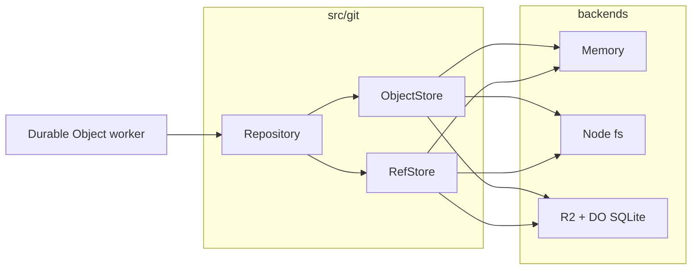

> [!WARNING]  
> Experimental: API is unstable and not production-ready.

# @chr33s/git

Universal Git smart-HTTP protocol server, browser client & unix cli — built on
[Effect](https://effect.website) v4 with modern TypeScript and Web APIs.

A ground-up rewrite of this repository's previous implementation, and now its
default: the git core, the working tree, the smart-HTTP server (v0 and v2,
shallow included), the JSON API, LFS, webhooks, the node host and the CLI are
real, tested code — stock `git` clones from and pushes to it, on Workers or
self-hosted, and reads the index and history our own commands write. See
[`docs/rewrite.md`](./docs/rewrite.md) for the rationale and the designs
deliberately not built.

## Prerequisites

- Node.js 24+ and npm 11+
- `git` on `PATH` (the interop tests drive the real binary)
- Chromium via Playwright, optional (the real-browser test skips without it)

## Architecture

The core is ports and adapters. `Repository` — commits, trees, refs, log — is
one service written against two storage ports, and every environment is a
layer swap underneath it:


```mermaid
flowchart LR
	subgraph domain["src/git"]
		R[Repository]
		OS[ObjectStore]
		RS[RefStore]
	end

	subgraph backends
		M[Memory]
		N[Node fs]
		CF[R2 + DO SQLite]
	end

	DO[Durable Object worker] --> R
	R --> OS
	R --> RS
	OS --> M
	OS --> N
	OS --> CF
	RS --> M
	RS --> N
	RS --> CF
```

One Durable Object per repository is not an arbitrary mapping: the DO's input
gate provides the serialization that `RefStore.apply`'s compare-and-swap
demands, and the filesystem backend buys the same guarantee with `rename(2)`.

### What runs today

| module                       | what it is                                                           |
| ---------------------------- | -------------------------------------------------------------------- |
| `src/git/Error.ts`           | tagged errors with `httpApiStatus` annotations                       |
| `src/git/Store.ts`           | `ObjectStore` / `RefStore` ports                                     |
| `src/git/Format.ts`          | the pure/effectful seam — framing, commit and tree codecs, hashing   |
| `src/git/Memory.ts`          | in-memory backend                                                    |
| `src/git/Node.ts`            | filesystem backend, git's own on-disk layout                         |
| `src/git/Repository.ts`      | the domain service                                                   |
| `src/git/Cloudflare.ts`      | R2 + Durable Object SQLite backend                                   |
| `src/git/Durable.ts`         | the Worker entry: one Durable Object per repository                  |
| `src/git/Pack.ts`            | streaming packfile transport, platform-neutral, git-interop-tested   |
| `src/git/Work.ts`            | `WorkTree` / `IndexStore` ports; `Checkout.ts` is the porcelain      |
| `src/git/Rebase.ts`          | replay: cherry-pick, and rebase as a sequence of them                |
| `src/git/Bisect.ts`          | which commit first broke it, as a function of the good/bad marks     |
| `src/git/History.ts`         | `git log -- <path>`, history simplification included                 |
| `src/server/Protocol.ts`     | git smart-HTTP: advertisement, upload-pack, receive-pack             |
| `src/server/Api.ts`          | JSON API as one `HttpApi` declaration; the client derives from it    |
| `src/server/Webhooks.ts`     | signed push delivery: `Schedule` retry, backgrounded, per-subscriber |
| `src/host/Node.ts`           | node host: the same handlers behind `node:http`, self-hostable       |
| `src/artifacts/Namespace.ts` | local Cloudflare Artifacts provider over alchemy's binding tag       |
| `src/artifacts/Sqlite.ts`    | the provider's registry + tokens on Durable Object SQLite            |
| `src/alchemy.run.ts`         | deployment stack: bucket, DO and Worker as values, not config        |
| `src/client/Fetch.ts`        | smart-HTTP fetch client: `lsRemote`, clone, incremental fetch        |
| `src/cli/main.ts`            | CLI: 29 commands, `npx chr33s-git` — repository, working tree, replay |
| `src/adapters/Opfs.ts`       | browser (OPFS) backend — same loose-object layout, fourth backend    |
| `src/client/Client.ts`       | browser client: derived JSON client, clone, local `Repository`       |
| `src/server/Auth.ts`         | scoped tokens: guard on both surfaces, HMAC or revocable verifiers   |
| `src/git/Store.contract.ts`  | one storage contract suite, run against all four backends            |
| `src/git/Inflate.ts`         | pull-based zlib inflate — exact stream boundaries, no `node:*`       |

The Worker (`src/alchemy.run.ts` → `src/worker.ts`, deployed with
`alchemy deploy`) serves the git smart-HTTP
protocol — stock `git` clones from and pushes to it, including
`clone --depth=1` and protocol v2 — plus Git LFS, and a schema-typed JSON API
per repository whose errors cross the wire as tagged values
(`{ "_tag": "RefConflict", … }`) with statuses from their own annotations.

The JSON API covers commits and content (`commit`, `commit-pack`, `blob`,
`tree`, `files`, `file`, `object`), history (`log`, `commits`, `diff`), refs
(`refs`, `branches`, `tags`, `reset`, `reflog`), history rewriting (`merge`,
`cherry-pick`, `rebase`), search (`grep`, `history`, `bisect`), remotes
(`remotes`, `fetch`, `push`, `pull`) and maintenance (`fsck`, `gc`) — plus
webhook registration, which is what makes a push deliver.

A repository can act as a client of another one: remotes are registered per
repository with an optional credential that is stored rather than sent, and
`pull` reports a non-fast-forward as its own outcome instead of guessing
whether a merge or a rebase was wanted.

There is also a working tree, for the CLI and any other host that has files
on disk: `status`, `add`, `rm`, `mv`, `restore`, `switch` and `commit`, over
an index at `.git/index` in git's own `DIRC` v2 format. Both implementations
can be pointed at the same checkout — `chr33s-git status` prints git's
porcelain, `git status` reads the index we wrote, and `git fsck --strict`
accepts the history we commit.

The working-tree verbs are not on the HTTP API, and that is the one boundary
still drawn on purpose: a bare server has no files, so serving `add` would
mean inventing a work tree behind the API. The server-side spelling is
`POST /:repo/commit-pack`, which streams an NDJSON body of file frames into a
commit without holding more than one file in memory.

The same handlers self-host on plain node — no Cloudflare account required:

```sh
GIT_ROOT=repos node src/host/Node.ts      # or: npx wrangler dev
git clone http://127.0.0.1:8080/my-repo
```

The deployed Worker always enforces scoped read/write tokens: `alchemy
deploy` reads `GIT_AUTH_SECRET` from the environment, binds it as a secret,
and fails the deploy if it is missing (stateless HMAC tokens via
`Auth.hmacMint`). The node host is open by default — pass `serve({ verify })`
to enforce. `git` presents the token as `http://<token>@host/repo`.

The CLI drives all of it — the same `Repository`, host, client and auth code:

```sh
npx chr33s-git init my-repo && npx chr33s-git serve --secret s3cret &
npx chr33s-git token my-repo --secret s3cret --scope write
npx chr33s-git clone --token <token> http://127.0.0.1:8080/my-repo my-copy
```

Working-tree commands take `--work`, a checkout whose repository is `.git`
inside it, rather than the bare repositories under `--root`:

```sh
npx chr33s-git add --work . . && npx chr33s-git status --work .
npx chr33s-git commit --work . --message "first"
npx chr33s-git switch --work . --create topic
```

## Development

```sh
npm install               # postinstall applies patches/ and regenerates worker types
npm run check             # format, lint, and typecheck (tsc -b --noEmit)
npm run fix               # auto-fix both
npx wrangler dev          # run the Worker locally on port 8080
npx wrangler deploy       # deploy (the tested path)
npx alchemy deploy        # deploy the same stack from src/alchemy.run.ts
```

## Testing

```sh
npm test                  # both projects: `unit` in parallel, then
                          # `integration`, which boots workerd via wrangler's
                          # createTestHarness
npx vitest run --project unit          # just the fast half
npx vitest run --project integration   # just the workerd half
```

Four kinds of evidence, deliberately:

- **oids match real git** — the empty tree and known blobs are pinned to the
  values `git hash-object` produces;
- **the repository is really a git repository** — `Node.interop.test.ts`
  writes one through the ports and has the `git` binary read it back
  (`fsck`, `log`, `cat-file`, `ls-tree`, `show`);
- **the contract holds on every backend** — the storage contract suite runs
  against memory, the filesystem, OPFS, and DO SQLite + R2 inside workerd,
  not against a mock;
- **the browser is a real browser** — Playwright loads the bundled client
  into Chromium, writes commits into actual OPFS, re-reads them through a
  fresh store, drives the derived JSON client same-origin, and executes a
  full smart-HTTP clone in-page over the pure-JS inflate (skipped when
  Chromium is absent);
- **the protocol is really git's protocol** — stock `git` clones, pushes,
  deletes branches and fetches incrementally against the server, over
  `node:http` in the unit suite and against the Durable Object in workerd in
  the integration suite.

## Notes

**Both dependencies are betas.** `effect@4.0.0-beta.107` and
`alchemy@2.0.0-beta.70` break between releases, so versions are pinned exactly
(`save-exact=true`) and upgrades are expected to cost churn.

**Two patches ship in [`patches/`](./patches)**, applied by `postinstall`.
One defers alchemy's `RepoClient.raw` so a third-party Artifacts provider can
exist at all; one aliases `Schema.TaggedErrorClass` in `effect` for alchemy's
transitive dependencies, which are built against a later spelling. Both are
upstream-shaped and deletable when the versions catch up.

**Cloudflare Artifacts provider.** `src/artifacts/` implements alchemy's
Artifacts binding over this server — registry, scoped tokens, fork via git
alternates, and import over smart HTTP — in memory, on disk, and on Durable
Object SQLite, held to one contract suite. Artifacts ships only a native
binding, so this is the local and self-hosted one.

**Open question: bundle size.** Effect core plus `unstable/http` and
`unstable/httpapi` is not small, and nothing has yet measured it against a
Worker's 3 MiB compressed limit.

**Deliberate deviations** from the Effect house style, and the designs
considered and rejected, are recorded in
[`docs/rewrite.md`](./docs/rewrite.md) under "Idiomatic Effect" and "Paths not
taken" — including why the storage ports are traced by one decorator rather
than per method, and why `it.effect` is not the default test variant.

## Documentation

- [`docs/rewrite.md`](./docs/rewrite.md) — the rewrite: motivation, mechanics, decisions
- [`docs/artifacts-provider.md`](./docs/artifacts-provider.md) — the Artifacts provider evaluation in full
- [`license.md`](./license.md) · [`security.md`](./security.md)
