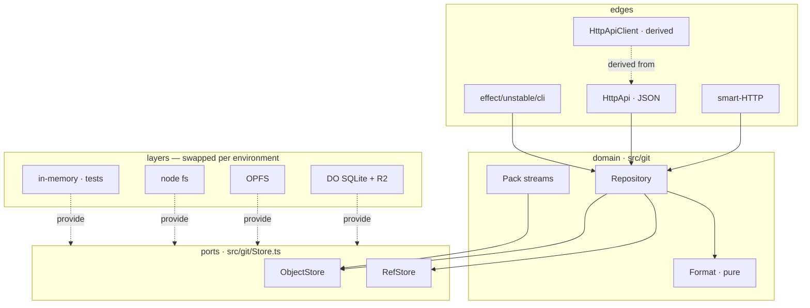

> [!NOTE]
> [artifacts](https://github.com/chr33s/git/tree/artifacts) branch tracks effect@beta / alchemy@beta rewrite, (self hostable cloudflare Artifacts)

> [!WARNING]  
> Experimental: API is unstable and not production-ready.

# @chr33s/git

Universal Git smart-HTTP protocol server, browser client & unix CLI — built on
[Effect](https://effect.website) v4 with modern TypeScript and Web APIs.

One implementation of git's core runs everywhere: in a Cloudflare Durable
Object, on plain node, in a browser tab, and in a terminal. Stock `git` clones
from it and pushes to it, and reads the index and history its own commands
write.

- [Why git-native, agent-first](#why-git-native-agent-first)
- [Install](#install)
- [Run a server](#run-a-server)
- [Use the CLI](#use-the-cli)
- [Single binary](#single-binary)
- [Benchmarks](#benchmarks)
- [Architecture](#architecture)
- [Development](#development)

## Why git-native, agent-first

Git already gives agents the right local model for code — cheap branches,
content addressing, everything offline. The hub design
([docs/hub.md](docs/hub.md)) extends that model to the collaboration layer,
which is where agents are otherwise stuck behind a hosting provider's API:

- **The whole project fetches.** A repository carries its source, identity,
  membership, pull requests, reviews and checks as git objects and refs. One
  fetch gives an agent complete, causally-ordered project state to project
  over — no API scraping, and losing a host's database loses nothing.
- **The forge runs in the sandbox.** One implementation serves from a Durable
  Object, plain node, a browser tab and the CLI, so an agent in an ephemeral
  container can host, review and merge locally — no rate limits, no third
  party in the loop.
- **Credentials fit the task.** Authority is capability-scoped
  (`source.push`, `hub.check:test`) and delegated credentials are short-lived,
  repository-pinned and minted by a member's own key — least privilege for an
  agent with no server secret or token registry, and revoking the member
  revokes every credential it minted.
- **Authorship is cryptographic.** When humans and agents share a repository,
  every review, check and trust change is SSH-signed and bound to an exact
  head — "who approved this?" has a verifiable answer, a CI key can vouch only
  for its own check, and self-approval structurally counts for nothing.
- **Concurrency is the designed-for case.** Hub state is an append-only event
  DAG per pull request that converges by DAG union, and merge policy applies
  through compare-and-swap at the ref boundary — parallel agents can't merge
  stale approvals or rewrite review history, no matter how fast they move.
- **Mistakes are containable.** A compromised agent key can be retroactively
  revoked, invalidating even accepted events; a leaked secret in a comment is
  removed by a replicating tombstone without breaking the hash chain.

The collaboration layer becomes as local, verifiable and automatable as the
code layer — which is what autonomous agents need and what a centralized
forge cannot hand them. [docs/agents.md](docs/agents.md) covers all of it in
three parts: giving an agent its own key, membership and signing setup; a
proposed spec carrying the sessions that produced the code — prompts, plans,
outcomes — as refs beside it; and the whole lifecycle walked once, from
`hub init` to a merged, provenanced, resumable change.

## Install

Node.js 24+ and npm 11+.

```sh
npm install     # postinstall applies patches/ and regenerates worker types
```

Both `effect` and `alchemy` are pinned betas installed behind `patch-package`
patches; the repo sets `save-exact=true` deliberately. Details in
[docs/internals.md](docs/internals.md#pinned-dependencies).

## Run a server

The node host serves a directory of bare repositories over git's smart-HTTP
protocol:

```sh
GIT_ROOT=repos node src/host/Node.ts
git clone http://127.0.0.1:8080/my-repo
```

`npx wrangler dev` runs the same handlers as a Cloudflare Worker — one Durable
Object per repository, refs and history in DO SQLite, blobs in R2 — and
`npx wrangler deploy` ships it.

Both hosts speak:

- **smart-HTTP** — protocol v0 and v2; clone, incremental and shallow fetch,
  push with side-band progress; `…/repo.git` and `…/repo` are the same
  repository
- **Git LFS** — batch API and transfer, objects streamed to storage
- **a JSON API** — one `HttpApi` declaration per repository covering content,
  history, refs, merge / cherry-pick / rebase, grep, remotes, maintenance and
  webhooks; the browser client in `src/client/Client.ts` is derived from the
  same declaration
- **webhooks** — signed push events, delivered with retries

Authority belongs to the repository, not to the server. There is no shared
secret to deploy and no server flag to set: a repository with a genesis
(`refs/meta/trust/genesis`) is guarded by its own SSH-key membership log, and
one without is a plain git repository served as one. `chr33s-git hub init`
gives a repository an identity; `chr33s-git credential` mints a short-lived
credential the holder signs with their own key, which `git` presents as
`http://<credential>@host/repo`. See `docs/hub.md`.

## Use the CLI

The CLI drives the same code the server runs — one `Repository`, one host, one
client, one auth path:

```sh
npx chr33s-git init my-repo && npx chr33s-git serve &
npx chr33s-git clone http://127.0.0.1:8080/my-repo my-copy
```

A repository with no genesis is readable by anyone who can reach the port and
writable by nobody — it has no membership to authorize a write with. `--open`
serves writes to those repositories anyway, which is what a scratch server on a
laptop wants and what a shared one should not have.

To require membership, give the repository an identity and mint a credential
for the key that holds it. `hub init` seeds that key as `repo.admin`, which
makes the repository private — so the credential needs `repo.read` to clone it
as well as `source.push` to write:

```sh
ssh-keygen -t ed25519 -f ~/.ssh/hub -N ""
npx chr33s-git hub init my-repo --key ~/.ssh/hub
npx chr33s-git credential my-repo --key ~/.ssh/hub --capability repo.read,source.push
npx chr33s-git clone --token <credential> http://127.0.0.1:8080/my-repo my-copy
```

Working-tree commands take `--work`, a checkout whose repository is `.git`
inside it, rather than the bare repositories under `--root`:

```sh
npx chr33s-git add --work . . && npx chr33s-git status --work .
npx chr33s-git commit --work . --message "first"
npx chr33s-git switch --work . --create topic
```

A fleet coordinates through the repository rather than beside it. `task`
records what needs doing, who holds it and how it resolved — signed events
appended to `refs/hub/task/<id>`, projected rather than stored. One task can
belong to another, and that is the whole hierarchy: a release, an epic and a
parent story are all just tasks that other tasks name, so each inherits
claiming, closing and provenance for free.

```sh
npx chr33s-git task open my-repo --key ~/.ssh/hub --title "v0.4 — Identity"
npx chr33s-git task open my-repo --key ~/.ssh/hub --title "Sign events" --parent <release>
npx chr33s-git task reparent my-repo <task> --key ~/.ssh/hub --parent <other-release>
npx chr33s-git task list my-repo          # what nobody currently holds
```

A claim is a lease and advisory: it frees itself when it expires, so an agent
that dies holding work releases it by doing nothing. `session` records what an
agent was told and what came of it, and `wake` runs a repository's own rules
when a push moves its hub refs. See [docs/agents.md](docs/agents.md).

34 commands in all: repositories (`init`, `clone`, `serve`, `hub`,
`credential`, `credential-helper`), the working tree (`add`, `rm`, `mv`,
`restore`, `status`, `switch`, `commit`), history (`log`, `history`, `show`,
`diff`, `grep`, `bisect`, `files`), refs (`branch`, `tag`, `refs`, `reset`),
rewriting (`merge`, `cherry-pick`, `rebase`), transport (`push`, `archive`),
agents (`task`, `session`, `wake`), and maintenance (`fsck`, `gc`).
`npx chr33s-git --help` lists them; every command takes `--help`.

## Web UI

`src/ui/` is a browser interface for a hosted repository — a file explorer and code
view over the JSON API, plus Tasks and Change Requests grouped by the release
they belong to. Built with Lit,
[`@chr33s/base-wc`](https://github.com/chr33s/base-wc) and Pierre's tree and
diff components; light and dark.

```sh
GIT_ROOT=repos npm run dev:ui   # watch, and serve page + API on :8000
npm run build:ui                # bundle to dist/ui
npm run verify:ui               # build it, then drive it in a browser
```

`dev:ui` is the one to reach for. It hands the built directory to the server
itself, so the page, the bundle and `/:repo/…` all answer on one port — a
browser blocks the cross-origin alternative outright, and the UI would quietly
fall back to its fixtures. `GIT_ROOT` defaults to the working directory.

The same arrangement without the watcher, from a finished bundle:

```sh
npm run build:ui && chr33s-git serve --root /path/to/repos --ui
```

`--ui-dir` points at a bundle built somewhere else. Which repository the page
shows is `<meta name="gp-repo">` in its `index.html`, `core` by default — so a
root without that repository serves the design's fixtures instead.

See [`src/ui/readme.md`](src/ui/readme.md) for what is wired to the server and what is
still fixture data.

## Single binary

`npm run build:sea` (node 26+) compiles the CLI into one self-contained
executable — no `node`, no `node_modules` on the machine it runs on:

```sh
npm run build:sea
./dist/sea/chr33s-git --help
```

esbuild folds the CLI and its dependencies into a single module, and node's
`--build-sea` embeds it into a copy of the node binary, for the platform the
script runs on.

## Benchmarks

The single binary against `git` 2.43 on the same machine (Linux x86_64
container, node 26.7.0). Mean of 9 runs after a warmup; peak RSS is the
child's own `ru_maxrss` via `wait4`. Work-tree and history actions run in a
200-commit, 200-file repository, repacked — `git repack -ad`, the state `gc`
leaves a repository in, and the one that makes both tools read objects out of
a pack rather than off the loose object path. Clone is a bare clone over local
smart-HTTP from `chr33s-git serve`, so both clients answer to the same host.

Two things have moved since these were taken. A build-time rewrite of
`effect/Schema` that deferred node's `fetch` initialization was dropped — it
made the binary a different program from the one the tests run — so the current
binary is about 19 ms and 7 MiB heavier on every row; `src/cli/sea.build.ts`
records why. And reading objects out of a pack now goes through the platform's
own zlib rather than the portable decoder, which took roughly 60% off the clone
row for both clients, since both clone from the same host.

| action            | `git`   | `chr33s-git` | `git` peak RSS | `chr33s-git` peak RSS |
| ----------------- | ------- | ------------ | -------------- | --------------------- |
| `--version`       | 2 ms    | 97 ms        | 12 MiB         | 64 MiB                |
| `init`            | 3 ms    | 104 ms       | 12 MiB         | 65 MiB                |
| `status`          | 3 ms    | 276 ms       | 12 MiB         | 81 MiB                |
| `add` (one file)  | 3 ms    | 122 ms       | 12 MiB         | 69 MiB                |
| `commit`          | 94 ms   | 123 ms       | 27 MiB         | 69 MiB                |
| `log -n 20`       | 2 ms    | 149 ms       | 12 MiB         | 78 MiB                |
| `clone` over HTTP | 6684 ms | 6628 ms      | 12 MiB         | 161 MiB               |

`git` wins every local row, and the shape of the loss is fixed cost, not
algorithm: ~97 ms of every run is the runtime coming up — 23 ms of that is
node itself (a hello-world SEA binary's floor here), the rest is module
initialization, with parse/compile already paid for by the V8 code cache the
build embeds. Peak RSS says more about the runtime the binary carries than about the
CLI: a hello-world SEA measures 76 MiB on the same machine, more than `--version`
here and within a few MiB of every row but `clone`, so read that column as
node's allocator with a workload on top rather than as the cost of the work.
The work on top of that floor is 7–180 ms per action (commit adds ~26 ms
against git's 94 ms total). The binary itself is 143 MiB against git's ~4 MiB,
for the same reason.

Clone is the row where the comparison stops being about the client. Both
clients clone from `chr33s-git serve`, and against a packed repository the
host — reading every object out of the pack, resolving deltas, building the
response — costs more than either client does, which is why the two land
within 1% of each other. Read that row as a measurement of the host, not of
`git` against `chr33s-git`.

The obvious next knob does not work: `useSnapshot`, which serializes the heap
after module initialization instead of only the compile cache, cannot build
this CLI on node 26.7.0 at all — and where it does build, it starts slower
than the code cache does. `src/cli/sea.build.ts` records why.

What the binary buys instead of speed: one file with zero dependencies, and
the same TypeScript the Worker, the node host and the browser client run — a
protocol or storage fix lands on all four surfaces at once.

## Architecture

`Repository` — commits, trees, refs, log — is one service written against two
storage ports, `ObjectStore` and `RefStore`. Every environment is a layer swap
underneath it.


```mermaid
flowchart TB
	subgraph ports["ports · src/git/Store.ts"]
		OS[ObjectStore]
		RS[RefStore]
	end

	subgraph domain["domain · src/git"]
		REPO[Repository]
		PACK[Pack streams]
		FMT[Format · pure]
	end

	subgraph edges["edges"]
		PROTO[smart-HTTP]
		API[HttpApi · JSON]
		CLI[effect/unstable/cli]
		CLIENT[HttpApiClient · derived]
	end

	subgraph layers["layers — swapped per environment"]
		CF[DO SQLite + R2]
		OPFS[OPFS]
		NODE[node fs]
		MEM[in-memory · tests]
	end

	PROTO --> REPO
	API --> REPO
	CLI --> REPO
	CLIENT -.derived from.-> API
	REPO --> OS & RS
	REPO --> FMT
	PACK --> OS
	CF & OPFS & NODE & MEM -.provide.-> ports
```

The dotted lines are the point: `Repository` and both HTTP edges name only the
ports, so the same program runs in the Durable Object, on node, in a tab, in
the CLI and in a test. One Durable Object maps to one repository because the
DO's input gate provides the serialization `RefStore.apply`'s compare-and-swap
demands — the filesystem backend buys the same guarantee with `rename(2)`, the
node host with a per-repository mutex. Below `Repository`, `Format.ts` is a
pure seam: byte work with no I/O (framing, codecs, hashing, deltas) stays
synchronous, and everything streams — nothing reads a request body whole,
nothing collects an object walk before the first byte goes out.

The design is a ground-up rewrite answering four structural problems in its
predecessor: a push could OOM the isolate (everything buffered; now everything
streams), errors were strings by the time they mattered (now every failure is
a typed, tagged value carrying its own HTTP status), cancellation stopped at
the door (now interruption reaches the object walk), and storage backends
disagreed about ref safety (now `RefStore.apply` is compare-and-swap on every
backend, proven by one contract suite run against all four). The full
reasoning, module map, conventions and testing philosophy live in
[docs/internals.md](docs/internals.md).

## Development

```sh
npm run check             # format, lint, and typecheck — both programs
npm run fix               # auto-fix both
npm test                  # unit + integration (workerd) projects
npm run build:sea         # dist/sea/chr33s-git — self-contained CLI binary (node 26+)
npm run build:ui          # bundle the browser UI to dist/ui
npm run dev:ui            # watch it, and serve page + API on :8000
npm run verify:ui         # build it, then drive it in a browser
npx wrangler dev          # run the Worker locally on port 8080
npx wrangler deploy       # deploy (the tested path)
```

`npm run check` must be green before a commit. It typechecks two programs, not
one: `src/` targets a Worker and `src/ui/` a browser, and they need different
`lib`s — DOM and WebWorker declare overlapping globals, and one program holding
both mis-resolves DOM members. `src/ui/tsconfig.json` says the rest.

The interop tests verify against the real `git` binary and need it on `PATH`;
the browser suites need Chromium via Playwright. Both skip when missing.

Before contributing, read [docs/internals.md](docs/internals.md) — the module
map, code conventions and testing philosophy explain constraints the code
cannot show you.
