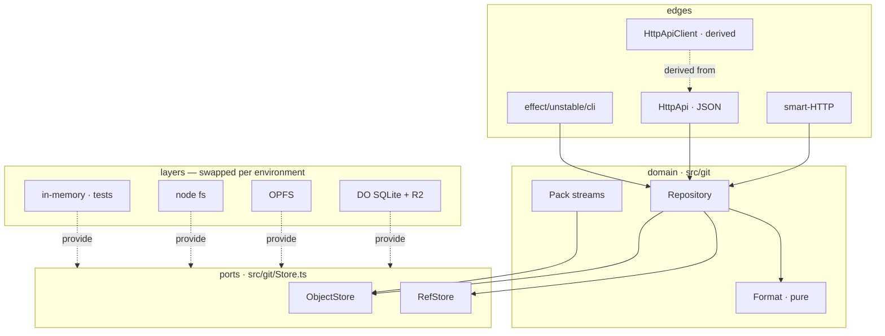

> [!WARNING]  
> Experimental: API is unstable and not production-ready.

# @chr33s/git

Universal Git smart-HTTP protocol server, browser client & unix CLI — built on
[Effect](https://effect.website) v4 with modern TypeScript and Web APIs.

One implementation of git's core runs everywhere: in a Cloudflare Durable
Object, on plain node, in a browser tab, and in a terminal. Stock `git` clones
from it and pushes to it, and reads the index and history its own commands
write.

- [Install](#install)
- [Run a server](#run-a-server)
- [Use the CLI](#use-the-cli)
- [Single binary](#single-binary)
- [Benchmarks](#benchmarks)
- [Architecture](#architecture)
- [Development](#development)

## Install

Node.js 24+ and npm 11+.

```sh
npm install     # postinstall applies patches/ and regenerates worker types
```

Both `effect` and `alchemy` are pinned betas installed behind `patch-package`
patches; the repo sets `save-exact=true` deliberately. Details in
[docs/internals.md](docs/internals.md#pinned-dependencies).

## Run a server

The node host serves a directory of bare repositories over git's smart-HTTP
protocol:

```sh
GIT_ROOT=repos node src/host/Node.ts
git clone http://127.0.0.1:8080/my-repo
```

`npx wrangler dev` runs the same handlers as a Cloudflare Worker — one Durable
Object per repository, refs and history in DO SQLite, blobs in R2 — and
`npx wrangler deploy` ships it.

Both hosts speak:

- **smart-HTTP** — protocol v0 and v2; clone, incremental and shallow fetch,
  push with side-band progress; `…/repo.git` and `…/repo` are the same
  repository
- **Git LFS** — batch API and transfer, objects streamed to storage
- **a JSON API** — one `HttpApi` declaration per repository covering content,
  history, refs, merge / cherry-pick / rebase, grep, remotes, maintenance and
  webhooks; the browser client in `src/client/Client.ts` is derived from the
  same declaration
- **webhooks** — signed push events, delivered with retries

The deployed Worker always enforces scoped read/write tokens (it fails to
deploy without `GIT_AUTH_SECRET`); the node host is open unless started with a
secret. `git` presents a token as `http://<token>@host/repo`.

## Use the CLI

The CLI drives the same code the server runs — one `Repository`, one host, one
client, one auth path:

```sh
npx chr33s-git init my-repo && npx chr33s-git serve --secret s3cret &
npx chr33s-git token my-repo --secret s3cret --scope write
npx chr33s-git clone --token <token> http://127.0.0.1:8080/my-repo my-copy
```

Working-tree commands take `--work`, a checkout whose repository is `.git`
inside it, rather than the bare repositories under `--root`:

```sh
npx chr33s-git add --work . . && npx chr33s-git status --work .
npx chr33s-git commit --work . --message "first"
npx chr33s-git switch --work . --create topic
```

29 commands in all: repositories (`init`, `clone`, `serve`, `token`), the
working tree (`add`, `rm`, `mv`, `restore`, `status`, `switch`, `commit`),
history (`log`, `history`, `show`, `diff`, `grep`, `bisect`, `files`), refs
(`branch`, `tag`, `refs`, `reset`), rewriting (`merge`, `cherry-pick`,
`rebase`), transport (`push`, `archive`), and maintenance (`fsck`, `gc`).
`npx chr33s-git --help` lists them; every command takes `--help`.

## Single binary

`npm run build:sea` (node 26+) compiles the CLI into one self-contained
executable — no `node`, no `node_modules` on the machine it runs on:

```sh
npm run build:sea
./dist/sea/chr33s-git --help
```

esbuild folds the CLI and its dependencies into a single module, and node's
`--build-sea` embeds it into a copy of the node binary, for the platform the
script runs on.

## Benchmarks

The single binary against `git` 2.43 on the same machine (Linux x86_64
container, node 26.7.0). Mean of 5 runs after a warmup; peak RSS is the
child's `ru_maxrss`. Work-tree and history actions run in a 200-commit,
200-file repository; clone is a bare clone over local smart-HTTP from
`chr33s-git serve`.

| action            | `git`  | `chr33s-git` | `git` peak RSS | `chr33s-git` peak RSS |
| ----------------- | ------ | ------------ | -------------- | --------------------- |
| `--version`       | 1 ms   | 103 ms       | 12 MiB         | 99 MiB                |
| `init`            | 3 ms   | 103 ms       | 12 MiB         | 99 MiB                |
| `status`          | 2 ms   | 193 ms       | 12 MiB         | 114 MiB               |
| `add` (one file)  | 2 ms   | 109 ms       | 13 MiB         | 102 MiB               |
| `commit`          | 92 ms  | 116 ms       | 26 MiB         | 108 MiB               |
| `log -n 20`       | 2 ms   | 113 ms       | 13 MiB         | 104 MiB               |
| `clone` over HTTP | 578 ms | 1244 ms      | 20 MiB         | 191 MiB               |

`git` wins every row, and the shape of the loss is fixed cost, not algorithm:
~100 ms of every run is the runtime coming up — ~23 ms of that is node itself
(a hello-world SEA binary's floor), the rest is effect's module
initialization, with parse/compile already paid for by the V8 code cache the
build embeds. ~95 MiB of the RSS is the node runtime the binary carries. The
work on top of that floor is 6–90 ms per action (commit adds ~13 ms against
git's 92 ms total). Clone, the one action that exercises negotiation, pack
parsing and storage together, comes in at 2.2× git's wall clock and ~10× its
memory. The binary itself is 143 MiB against git's ~4 MiB, for the same
reason.

What the binary buys instead of speed: one file with zero dependencies, and
the same TypeScript the Worker, the node host and the browser client run — a
protocol or storage fix lands on all four surfaces at once.

## Architecture

`Repository` — commits, trees, refs, log — is one service written against two
storage ports, `ObjectStore` and `RefStore`. Every environment is a layer swap
underneath it.


```mermaid
flowchart TB
	subgraph ports["ports · src/git/Store.ts"]
		OS[ObjectStore]
		RS[RefStore]
	end

	subgraph domain["domain · src/git"]
		REPO[Repository]
		PACK[Pack streams]
		FMT[Format · pure]
	end

	subgraph edges["edges"]
		PROTO[smart-HTTP]
		API[HttpApi · JSON]
		CLI[effect/unstable/cli]
		CLIENT[HttpApiClient · derived]
	end

	subgraph layers["layers — swapped per environment"]
		CF[DO SQLite + R2]
		OPFS[OPFS]
		NODE[node fs]
		MEM[in-memory · tests]
	end

	PROTO --> REPO
	API --> REPO
	CLI --> REPO
	CLIENT -.derived from.-> API
	REPO --> OS & RS
	REPO --> FMT
	PACK --> OS
	CF & OPFS & NODE & MEM -.provide.-> ports
```

The dotted lines are the point: `Repository` and both HTTP edges name only the
ports, so the same program runs in the Durable Object, on node, in a tab, in
the CLI and in a test. One Durable Object maps to one repository because the
DO's input gate provides the serialization `RefStore.apply`'s compare-and-swap
demands — the filesystem backend buys the same guarantee with `rename(2)`, the
node host with a per-repository mutex. Below `Repository`, `Format.ts` is a
pure seam: byte work with no I/O (framing, codecs, hashing, deltas) stays
synchronous, and everything streams — nothing reads a request body whole,
nothing collects an object walk before the first byte goes out.

The design is a ground-up rewrite answering four structural problems in its
predecessor: a push could OOM the isolate (everything buffered; now everything
streams), errors were strings by the time they mattered (now every failure is
a typed, tagged value carrying its own HTTP status), cancellation stopped at
the door (now interruption reaches the object walk), and storage backends
disagreed about ref safety (now `RefStore.apply` is compare-and-swap on every
backend, proven by one contract suite run against all four). The full
reasoning, module map, conventions and testing philosophy live in
[docs/internals.md](docs/internals.md).

## Development

```sh
npm run check             # format, lint, and typecheck (tsc -b --noEmit)
npm run fix               # auto-fix both
npm test                  # unit + integration (workerd) projects
npm run build:sea         # dist/sea/chr33s-git — self-contained CLI binary (node 26+)
npx wrangler dev          # run the Worker locally on port 8080
npx wrangler deploy       # deploy (the tested path)
```

`npm run check` must be green before a commit. The interop tests verify
against the real `git` binary and need it on `PATH`; the real-browser test
needs Chromium via Playwright. Both skip when missing.

Before contributing, read [docs/internals.md](docs/internals.md) — the module
map, code conventions and testing philosophy explain constraints the code
cannot show you.
